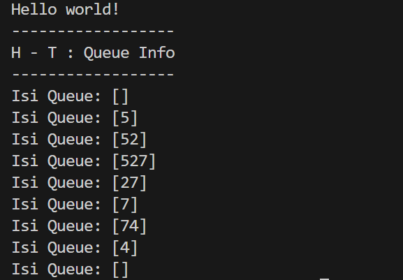
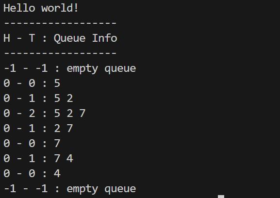
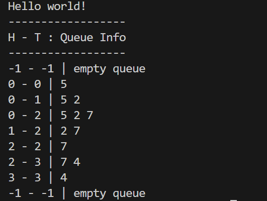
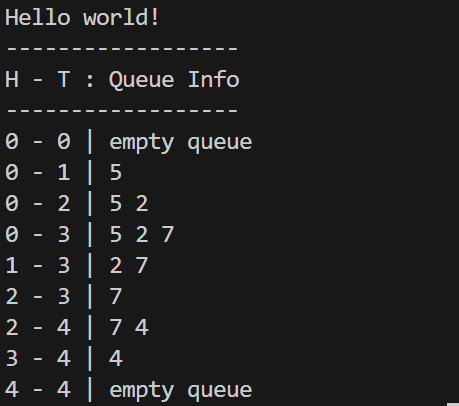

## 1. Nama, NIM, Kelas
- **Nama**: Arzaqi Fatih Muttaqin
- **NIM**: 103112430092
- **Kelas**: Struktur Data-05

## 2. Motivasi Belajar Struktur Data
Belajar struktur data bukan sekadar menghafal teori atau menulis kode, melainkan proses melatih pola pikir agar lebih terstruktur, efisien, dan logis. Data dapat dianalogikan seperti barang di gudang: jika diletakkan sembarangan akan sulit dicari, tetapi bila disusun dengan sistem yang jelas, semuanya menjadi rapi dan mudah diakses. Dengan menguasai struktur data, kita dibekali kemampuan untuk mengelola dan menyelesaikan masalah secara efektif, baik dalam pemrograman maupun kehidupan sehari-hari. Meski terasa rumit di awal, setiap materi yang dipelajari merupakan investasi berharga untuk membangun kesiapan menghadapi tantangan di dunia teknologi.
## 3. Dasar Teori

Struktur data merupakan teknik untuk menyimpan dan mengatur data di dalam komputer agar proses pengolahan dapat berjalan secara efektif dan optimal. Salah satu konsep dasar yang penting dalam struktur data adalah queue atau antrean. Queue termasuk struktur data linier yang menerapkan prinsip FIFO (First In, First Out), yaitu data yang pertama masuk akan menjadi data pertama yang keluar. Konsep ini serupa dengan antrean di kehidupan sehari-hari, seperti di loket pelayanan, di mana orang yang datang lebih dulu akan dilayani lebih dulu. Pada queue, penambahan elemen dilakukan di bagian belakang yang disebut tail melalui operasi enqueue, sedangkan penghapusan elemen dilakukan dari bagian depan yang disebut head melalui operasi dequeue.

Queue dapat diimplementasikan menggunakan array dengan bantuan dua variabel penunjuk, yaitu head dan tail, untuk menandai posisi elemen terdepan dan terakhir. Implementasi paling sederhana menggunakan metode naif, di mana head selalu berada di indeks 0 selama antrean tidak kosong. Cara ini memudahkan proses enqueue, tetapi membuat dequeue menjadi tidak efisien karena setiap penghapusan elemen mengharuskan seluruh data lainnya digeser ke depan. Untuk mengatasi kelemahan tersebut, digunakan metode kedua, yaitu dengan memindahkan posisi head tanpa menggeser data. Metode ini membuat proses dequeue lebih efisien, namun menimbulkan masalah penuh semu, yaitu kondisi ketika tail telah mencapai akhir array sementara masih terdapat ruang kosong di bagian awal yang tidak dapat dimanfaatkan. Solusi yang paling efektif untuk permasalahan ini adalah circular queue, di mana array diperlakukan seperti membentuk lingkaran. Dengan memanfaatkan operasi modulo, posisi head dan tail dapat kembali ke indeks awal setelah mencapai batas akhir array, sehingga seluruh kapasitas array dapat digunakan secara optimal dan proses enqueue serta dequeue dapat berjalan dengan efisien.
## 4. Guided
### 4.1 Guided 1
```cpp
#ifndef QUEUE_H

#define QUEUE_H

  

#include <iostream>

using namespace std;

  

#define MAX_QUEUE 5

typedef int infotype;

  

struct Queue {

    infotype info[MAX_QUEUE];

    int head;

    int tail;

    int count;

};

  

void createQueue(Queue &Q);

bool isEmptyQueue(Queue Q);

bool isFullQueue(Queue Q);

void enqueue(Queue &Q, infotype x);

infotype dequeue(Queue &Q);

void printInfo(Queue Q);

  

#endif
```
Penjelasan : File header queue.h berperan sebagai rancangan utama atau acuan dalam pembuatan struktur data antrean (queue). Pada file ini ditentukan batas maksimum jumlah elemen antrean, yaitu sebanyak 5 elemen melalui konstanta MAX_QUEUE, serta pendefinisian infotype sebagai alias dari tipe data integer. Di dalamnya juga dideklarasikan sebuah struktur Queue yang memuat array info sebagai tempat penyimpanan data, serta dua variabel bertipe integer, head dan tail, yang berfungsi untuk menandai posisi awal dan akhir antrean. Selain itu, queue.h berisi daftar deklarasi fungsi atau prototipe, seperti createQueue, enqueue, dequeue, dan fungsi pendukung lainnya, yang digunakan untuk mengelola antrean. Adapun detail implementasi dan logika dari fungsi-fungsi tersebut tidak dituliskan di file ini, melainkan ditempatkan pada file .cpp terpisah.


### 4.2 Guided 2
```cpp
#include <iostream>

#include "queue.h"

using namespace std;

  

int main() {

    cout << "Hello world!" << endl;

    Queue Q;

    cout << "------------------" << endl;

    cout << "H - T : Queue Info" << endl;

    cout << "------------------" << endl;

  

    createQueue(Q);

    printInfo(Q);

  

    enqueue(Q, 5);

    printInfo(Q);  

  

    enqueue(Q, 2);

    printInfo(Q);  

  

    enqueue(Q, 7);

    printInfo(Q);  

  

    dequeue(Q);

    printInfo(Q);

  

    dequeue(Q);

    printInfo(Q);

  

    enqueue(Q, 4);

    printInfo(Q);  

  

    dequeue(Q);

    printInfo(Q);

  

    dequeue(Q);

    printInfo(Q);

  

    return 0;

}
```


Penjelasan :File main.cpp berfungsi sebagai program utama yang digunakan untuk melakukan pengujian terhadap implementasi struktur data antrean (queue). Program diawali dengan menampilkan header tabel yang menunjukkan informasi H, T, dan isi antrean, kemudian memanggil fungsi createQueue untuk menginisialisasi antrean Q dan menampilkannya dalam kondisi awal yang masih kosong.
Selanjutnya, program melakukan pengujian dengan menambahkan tiga data secara berurutan, yaitu 5, 2, dan 7, menggunakan operasi enqueue. Setelah itu, dilakukan skenario pengujian campuran, di mana program menjalankan operasi dequeue sebanyak dua kali untuk mengeluarkan elemen 5 dan 2, kemudian menambahkan elemen baru bernilai 4. Pada tahap akhir, antrean dikosongkan sepenuhnya dengan memanggil operasi dequeue hingga tidak ada elemen yang tersisa. Setiap proses selalu diikuti dengan pemanggilan fungsi printInfo, sehingga perubahan isi antrean beserta posisi head dan tail dapat diamati secara bertahap dari awal hingga akhir eksekusi program.

Output: 



### 4.3 Guided 3

```cpp
#include "queue.h"

  

void createQueue(Queue &Q) {

    Q.head = -1;

    Q.tail = -1;

}

  

bool isEmptyQueue(Queue Q) {

    return Q.tail == -1;

}

  

bool isFullQueue(Queue Q) {

    return Q.tail == MAX_QUEUE - 1;

}

  

void enqueue(Queue &Q, infotype x) {

    if (isFullQueue(Q)) {

        cout << "Antrean Penuh!" << endl;

    } else {

        if (isEmptyQueue(Q)) {

            Q.head = 0;

        }

        Q.tail++;

        Q.info[Q.tail] = x;

    }

}

  

infotype dequeue(Queue &Q) {

    if (isEmptyQueue(Q)) {

        cout << "Antrean Kosong!" << endl;

        return -1;

    } else {

        infotype x = Q.info[Q.head];

        for (int i = Q.head; i < Q.tail; i++) {

            Q.info[i] = Q.info[i + 1];

        }

        Q.tail--;

        if (Q.tail == -1) {

            Q.head = -1;    

        }

        return x;

    }

}

  

void printInfo(Queue Q) {

    cout << Q.head << " - " << Q.tail << " : ";

    if (isEmptyQueue(Q)) {

        cout << "empty queue" << endl;

    } else {

        for (int i = Q.head; i <= Q.tail; i++) {

            cout << Q.info[i];

            if (i < Q.tail) {

                cout << " ";

            }

        }

        cout << endl;

    }

}
```


Penjelasan :Kode tersebut merupakan realisasi dari Alternatif 1 atau yang dikenal sebagai antrean naif, sebagaimana dijelaskan pada modul 8. Pada pendekatan ini, posisi head selalu tetap berada di indeks 0, sehingga setiap kali dilakukan operasi dequeue, seluruh elemen yang tersisa harus dipindahkan satu per satu ke arah kiri untuk menutup ruang kosong yang ditinggalkan elemen terdepan.
Proses inisialisasi dilakukan melalui fungsi createQueue, yang menetapkan kondisi awal antrean sebagai kosong dengan memberikan nilai -1 pada head dan tail. Penentuan kondisi antrean kosong dan penuh sepenuhnya bergantung pada nilai tail, di mana antrean dianggap kosong jika tail bernilai -1, dan dianggap penuh ketika tail sudah mencapai batas maksimum array, yaitu MAX_QUEUE - 1.
Pada fungsi enqueue, langkah pertama adalah memastikan antrean belum penuh. Jika antrean masih kosong, maka head diatur ke indeks 0. Setelah itu, tail selalu dinaikkan terlebih dahulu, kemudian nilai elemen baru dimasukkan ke posisi tail tersebut. Mekanisme ini memastikan penambahan data selalu terjadi di bagian belakang antrean.
Operasi dequeue menjadi ciri utama dari pendekatan ini. Setelah dipastikan antrean tidak kosong, elemen terdepan diambil dari posisi Q.info[0]. Selanjutnya, sebuah perulangan dijalankan untuk menggeser seluruh elemen berikutnya ke satu indeks lebih kecil. Setelah proses penggeseran selesai, nilai tail dikurangi satu. Jika setelah pengurangan tail bernilai -1, maka head juga diatur kembali ke -1 sebagai penanda bahwa antrean telah kosong. Nilai elemen yang diambil kemudian dikembalikan oleh fungsi.
Fungsi printInfo digunakan untuk menampilkan kondisi antrean saat ini dengan mencetak nilai head dan tail. Apabila antrean kosong, akan ditampilkan keterangan “empty queue”. Jika tidak kosong, seluruh elemen antrean dicetak secara berurutan mulai dari indeks head hingga tail dengan pemisah spasi, sehingga isi antrean dapat diamati dengan jelas.
Output : 



## 5. Unguided
### 5.1 Unguided 1
```cpp
#include "queue.h"

  

void createQueue(Queue &Q) {

    Q.head = -1;

    Q.tail = -1;

}

  

bool isEmptyQueue(Queue Q) {

    return Q.tail == -1 || Q.head > Q.tail;

}

  

bool isFullQueue(Queue Q) {

    return Q.tail == MAX_QUEUE - 1;

}

  

void enqueue(Queue &Q, infotype x) {

    if (isFullQueue(Q)) {

        cout << "Antrean Penuh (Penuh Semu)!" << endl;

    } else {

        if (isEmptyQueue(Q)) {

            Q.head = 0;

        }

        Q.tail++;

        Q.info[Q.tail] = x;

    }

}

  

infotype dequeue(Queue &Q) {

    if (isEmptyQueue(Q)) {

        cout << "Antrean Kosong!" << endl;

        return -1;

    } else {

        infotype x = Q.info[Q.head];

        Q.head++;

        if (Q.head > Q.tail) {

            Q.head = -1;      

            Q.tail = -1;

        }

        return x;

    }

}

  

void printInfo(Queue Q) {

    cout << Q.head << " - " << Q.tail << " | ";

    if (isEmptyQueue(Q)) {

        cout << "empty queue" << endl;

    } else {

        for (int i = Q.head; i <= Q.tail; i++) {

            cout << Q.info[i] << " ";

        }

        cout << endl;

    }

}
```

Penjelasan ::Kode ini mengimplementasikan **Alternatif 2** (Antrean Geser) dari modul 8. Metode ini lebih efisien daripada Alternatif 1 karena `dequeue` tidak perlu menggeser elemen, melainkan hanya menggeser `head`.
Fungsi `createQueue` sama dengan Alternatif 1, yaitu menginisialisasi `head` dan `tail` ke `-1`.
Fungsi `isEmptyQueue` sedikit lebih kompleks. Antrean dianggap kosong jika `tail == -1` (kondisi awal) ATAU jika `head` telah bergerak melewati `tail` (`Q.head > Q.tail`) setelah beberapa kali `dequeue`.
Fungsi `isFullQueue` hanya memeriksa jika `tail` sudah mencapai akhir array (`MAX_QUEUE - 1`). Ini penting karena metode ini dapat mengalami **"Penuh Semu" (Pseudo-Full)** .
Fungsi `enqueue` (menambah elemen) sama persis dengan Alternatif 1. Ia akan menolak elemen baru jika `isFullQueue` benar (termasuk jika penuh semu). Jika tidak, ia mengatur `head` ke `0` saat elemen pertama masuk, lalu menaikkan `tail` dan menyisipkan elemen.
Fungsi `dequeue` (menghapus elemen) adalah bagian yang berbeda secara fundamental. Setelah antrean dipastikan tidak kosong, ia mengambil elemen di `Q.head`. Alih-alih menggeser array, ia **hanya memajukan `head`** (`Q.head++`). Ini membuatnya jauh lebih cepat. Jika pemanggilan `dequeue` ini menyebabkan `head` melewati `tail` (yang berarti antrean menjadi kosong), ia akan mereset `head` dan `tail` kembali ke `-1`.
Fungsi `printInfo` mencetak status `head` dan `tail`. Saat mencetak isi antrean, ia hanya mencetak elemen dari `Q.head` hingga `Q.tail`, mengabaikan slot-slot kosong yang mungkin ditinggalkan di awal array.

Output : 



### 5.1 Unguided 2
```cpp
#include "queue.h"

  

void createQueue(Queue &Q) {

    Q.head = 0;

    Q.tail = 0;

}

  

bool isEmptyQueue(Queue Q) {

    return Q.head == Q.tail;

}

  

bool isFullQueue(Queue Q) {

    return (Q.tail + 1) % MAX_QUEUE == Q.head;

}

  

void enqueue(Queue &Q, infotype x) {

    if (isFullQueue(Q)) {

        cout << "Antrean Penuh!" << endl;

    } else {

        Q.info[Q.tail] = x;

        Q.tail = (Q.tail + 1) % MAX_QUEUE;

    }

}

  

infotype dequeue(Queue &Q) {

    if (isEmptyQueue(Q)) {

        cout << "Antrean Kosong!" << endl;

        return -1;

    } else {

        infotype x = Q.info[Q.head];

        Q.head = (Q.head + 1) % MAX_QUEUE;

        return x;

    }

}

  

void printInfo(Queue Q) {

    cout << Q.head << " - " << Q.tail << " | ";

    if (isEmptyQueue(Q)) {

        cout << "empty queue" << endl;

    } else {

        int i = Q.head;

        while (i != Q.tail) {

            cout << Q.info[i] << " ";

            i = (i + 1) % MAX_QUEUE;

        }

        cout << endl;

    }

}
```

Penjelasan ::Kode ini mengimplementasikan **Alternatif 3 (Circular Queue)**, yang merupakan metode paling efisien untuk antrean berbasis array . Metode ini memperlakukan array seolah-olah "berputar" (melingkar), sehingga tidak ada elemen yang digeser dan tidak ada masalah "penuh semu".

Fungsi `createQueue` menginisialisasi antrean dengan mengatur `head` dan `tail` ke `0`.

Fungsi `isEmptyQueue` bekerja dengan prinsip bahwa antrean kosong jika `head` dan `tail` menunjuk ke lokasi yang sama (`Q.head == Q.tail`).

Fungsi `isFullQueue` memeriksa apakah antrean penuh dengan mengecek apakah `tail` berada tepat "di belakang" `head` secara melingkar. Logika `(Q.tail + 1) % MAX_QUEUE == Q.head` digunakan untuk "mengorbankan" satu slot agar bisa membedakan antara kondisi penuh dan kosong.

Fungsi `enqueue` (menambah elemen) dan `dequeue` (menghapus elemen) adalah inti dari metode ini. Keduanya menggunakan **operasi modulo (`%`)** untuk memajukan `tail` dan `head` . Saat `enqueue`, `tail` dimajukan dengan `(Q.tail + 1) % MAX_QUEUE`. Saat `dequeue`, `head` dimajukan dengan `(Q.head + 1) % MAX_QUEUE`. Ini membuat kedua penunjuk "berputar" kembali ke 0 secara otomatis saat mencapai akhir array.

Fungsi `printInfo` juga menggunakan logika melingkar. Ia memulai _loop_ dari `Q.head` dan terus berputar (menggunakan `i = (i + 1) % MAX_QUEUE`) sambil mencetak elemen, hingga `i` bertemu kembali dengan `Q.tail`.

Output : 



## 6. Kesimpulan
Berikut versi kesimpulan tanpa penggunaan teks tebal:

---

Berdasarkan hasil analisis terhadap modul dan implementasi program, dapat disimpulkan bahwa struktur data Antrean (Queue) yang menggunakan array dapat diimplementasikan dengan beberapa pendekatan, di mana setiap pendekatan memiliki karakteristik serta tingkat efisiensi yang berbeda.
Pada Alternatif 1 (unguided1.cpp), antrean diimplementasikan dengan cara paling sederhana, yaitu posisi head selalu berada pada indeks 0. Pendekatan ini mudah dipahami dan diimplementasikan, namun memiliki kelemahan utama pada operasi dequeue. Setiap penghapusan elemen mengharuskan seluruh elemen yang tersisa digeser ke kiri, sehingga menyebabkan proses menjadi tidak efisien, terutama ketika jumlah data dalam antrean cukup besar.
Alternatif 2 (unguided2.cpp) dikembangkan untuk mengatasi masalah pergeseran elemen tersebut dengan membiarkan posisi head dan tail bergerak maju. Dengan metode ini, operasi dequeue dapat dilakukan lebih cepat karena tidak memerlukan penggeseran data. Namun, pendekatan ini menimbulkan permasalahan baru berupa kondisi penuh semu, yaitu keadaan di mana antrean dianggap penuh saat tail mencapai batas akhir array, padahal masih terdapat ruang kosong di bagian awal array yang tidak dapat digunakan kembali.
Solusi yang paling efektif ditunjukkan pada Alternatif 3 (unguided3.cpp) melalui penerapan konsep Circular Queue. Dengan memperlakukan array sebagai struktur melingkar menggunakan operasi modulo, head dan tail dapat kembali ke indeks awal setelah mencapai indeks terakhir. Pendekatan ini memungkinkan pemanfaatan array secara maksimal serta menjaga agar operasi enqueue dan dequeue tetap berjalan secara efisien tanpa adanya penggeseran data maupun masalah penuh semu.

---
## 7. Referensi
1. Aini, S. N. & Kurniawan R., R. (2025). 'Sistem Antrian Pasien Berbasis Web Dengan Algoritma Circular Queue Pada Klinik Pratama Rawat Inap Ar-Razi'. _CESS (Journal of Computer Engineering, System and Science)_, 10(2).
2. Bollina, S. V. T. (2024). _What is a circular queue, and how does it differ from a regular queue?_
3. Trijayanti, A., Aulia, I., Khairunisa, N., Purba, F. A. H. & Gunawan, I. (2025). 'Implementasi Struktur Data Antrian Queue dalam Sistem Penjadwalan Proses pada Sistem Operasi'. _Jurnal Publikasi Teknik Informatika_, 4(2), hlm. 48–53.