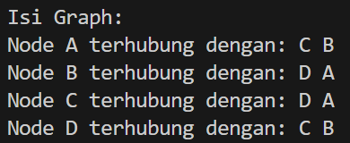
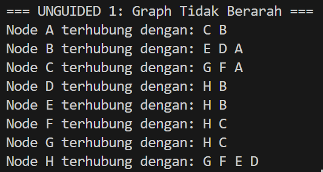
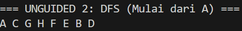
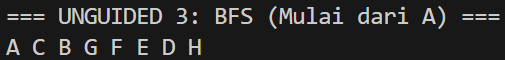

## 1. Nama, NIM, Kelas
- **Nama**: Arzaqi Fatih Muttaqin
- **NIM**: 103112430092
- **Kelas**: Struktur Data-05

## 2. Motivasi Belajar Struktur Data
Belajar struktur data itu sebenarnya bukan cuma soal hafalan teori atau sekadar nulis kode, tapi lebih ke melatih cara berpikir supaya jadi lebih rapi, efisien, dan logis. Data bisa dianalogikan seperti barang di gudang; kalau ditaruh asal-asalan pasti ribet nyarinya, tapi kalau disusun pakai sistem, semuanya jadi lebih gampang dan cepat ditemukan. Dengan paham struktur data, kita punya bekal penting buat nyelesain berbagai masalah, baik dalam pemrograman maupun kehidupan sehari-hari, karena pola pikirnya terbiasa mencari cara yang paling efektif. Jadi meskipun di awal terasa agak sulit, anggap saja tiap materi itu sebagai investasi kecil yang nantinya bakal sangat berguna di dunia teknologi.

## 3. Dasar Teori

Struktur data merupakan cara untuk menyimpan dan mengatur data di dalam komputer agar dapat diakses dan diproses dengan lebih efektif. Salah satu teori dasar yang penting dalam struktur data adalah graph.

Graph adalah sekumpulan elemen yang tidak kosong, terdiri dari node (atau vertex) dan edge sebagai penghubung antar node. Konsep graph sering ditemui dalam kehidupan sehari-hari, misalnya lokasi kost dan laboratorium dapat dianggap sebagai node, sedangkan jalan yang menghubungkan keduanya berperan sebagai edge. Dalam penerapannya pada program, node induk biasanya menyimpan data utama, sementara node anak atau edge menyimpan alamat memori yang menunjuk ke node lain sehingga terbentuk hubungan antar data.

Dilihat dari arah hubungannya, graph terbagi menjadi dua jenis, yaitu graph berarah (Directed Graph) dan graph tidak berarah (Undirected Graph). Pada graph berarah, setiap edge memiliki arah tertentu, sehingga hubungan dari node A ke node B belum tentu berarti node B terhubung kembali ke node A. Sebaliknya, pada graph tidak berarah, hubungan antar node berlaku dua arah secara otomatis. Untuk merepresentasikan graph di dalam memori komputer, dapat digunakan Matriks Ketetanggaan berupa array dua dimensi atau struktur Multi Linked List. Dalam praktikum ini, Multi Linked List lebih dipilih karena bersifat dinamis dan lebih fleksibel dalam menangani perubahan jumlah data.

Konsep penting lain dalam graph adalah ketetanggaan, yaitu kondisi ketika dua node terhubung langsung oleh sebuah edge. Untuk melakukan penelusuran ke seluruh node dalam graph, digunakan algoritma seperti Breadth First Search (BFS) dan Depth First Search (DFS). BFS menelusuri graph secara melebar, dimulai dari node awal pada tingkat teratas lalu mengunjungi node-node tetangganya. Sementara itu, DFS menelusuri graph secara mendalam dengan mengikuti satu jalur hingga mencapai node terdalam sebelum kembali dan melanjutkan ke jalur lainnya.
## 4. Guided
### 4.1 Guided 1
```cpp
#ifndef GRAPH_H

#define GRAPH_H

#include <iostream>

using namespace std;

  

typedef char infoGraph;

typedef struct ElmNode *adrNode;

typedef struct ElmEdge *adrEdge;

  

struct ElmNode {

    infoGraph info;

    bool visited;    

    adrEdge firstEdge;

    adrNode next;

};

  

struct ElmEdge {

    adrNode node;

    adrEdge next;

};

  

struct Graph {

    adrNode first;

};

  

void createGraph(Graph &G);

adrNode allocateNode(infoGraph X);

void insertNode(Graph &G, infoGraph X);

  

adrNode findNode(Graph &G, infoGraph X);

void connectNode(Graph &G, infoGraph N1, infoGraph N2); // Undirected

  

void printGraph(Graph G);

void printDFS(Graph G, adrNode N);

void printBFS(Graph G, adrNode N);

  

#endif
```
Penjelasan : File graph.h berfungsi sebagai header yang mendefinisikan ADT dan struktur data untuk merepresentasikan graph dengan metode adjacency list. Di dalamnya terdapat struktur ElmNode untuk menyimpan data simpul, status kunjungan, serta pointer ke sisi dan simpul lain, ElmEdge sebagai penghubung antar simpul, dan struktur Graph yang menyimpan alamat elemen pertama. Selain itu, graph.h juga berisi deklarasi tipe pointer dan prototipe fungsi dasar seperti pembuatan graph, alokasi node, penambahan dan penghubungan simpul, serta penelusuran graph menggunakan DFS dan BFS, sehingga program lebih rapi dan terstruktur.


### 4.2 Guided 2
```cpp
#include "graph.h"

  

void createGraph(Graph &G) {

    G.first = NULL;

}

  

adrNode allocateNode(infoGraph X) {

    adrNode P = new ElmNode;

    P->info = X;

    P->visited = false;

    P->firstEdge = NULL;

    P->next = NULL;

    return P;

}

  

void insertNode(Graph &G, infoGraph X) {

    adrNode P = allocateNode(X);

    if (G.first == NULL) {

        G.first = P;

    } else {

        adrNode Q = G.first;

        while (Q->next != NULL) {

            Q = Q->next;

        }

        Q->next = P;

    }

}
```


Penjelasan :File graph_init.cpp berisi implementasi fungsi-fungsi dasar untuk inisialisasi struktur graph dan alokasi memori. Di dalamnya terdapat fungsi createGraph yang mengatur kondisi awal graph dengan mengeset pointer utama ke NULL, serta fungsi allocateNode yang membuat simpul baru dan memberi nilai awal, seperti mengisi data dan mengatur status visited menjadi false. Selain itu, file ini juga mengatur penambahan simpul melalui fungsi insertNode, yaitu dengan memanggil proses alokasi lalu menelusuri daftar simpul hingga elemen terakhir untuk menyambungkan simpul baru di bagian akhir, sehingga graph dapat menampung node secara dinamis.

### 4.3 Guided 3

```cpp
#include "graph.h"

  

adrNode findNode(Graph &G, infoGraph X) {

    adrNode P = G.first;

    while (P != NULL) {

        if (P->info == X) return P;

        P = P->next;

    }

    return NULL;

}

  

void connectNode(Graph &G, infoGraph N1, infoGraph N2) {

    adrNode p1 = findNode(G, N1);

    adrNode p2 = findNode(G, N2);

  

    if (p1 != NULL && p2 != NULL) {

        adrEdge e1 = new ElmEdge;

        e1->node = p2;

        e1->next = p1->firstEdge;

        p1->firstEdge = e1;

  

        adrEdge e2 = new ElmEdge;

        e2->node = p1;

        e2->next = p2->firstEdge;

        p2->firstEdge = e2;

    }

}
```


Penjelasan : File graph_edge.cpp berfokus pada pengelolaan hubungan antar simpul dalam graph. Di dalamnya terdapat fungsi findNode yang digunakan untuk mencari simpul tertentu dengan cara menelusuri daftar simpul satu per satu berdasarkan nilai datanya. Fungsi utama pada file ini adalah connectNode, yang berperan menghubungkan dua simpul yang valid dengan membuat edge baru yang menyimpan alamat simpul tujuan. Proses penambahan edge dilakukan dengan teknik insert first, yaitu menempatkan edge baru di bagian awal daftar ketetanggaan (firstEdge) milik simpul asal. Pendekatan ini membuat pembentukan relasi antar simpul menjadi lebih sederhana dan efisien.


### 4.4 Guided 4

```cpp
#include "graph.h"

#include <queue>

  

void printGraph(Graph G) {

    adrNode P = G.first;

    while (P != NULL) {

        cout << "Node " << P->info << " terhubung dengan: ";

        adrEdge E = P->firstEdge;

        while (E != NULL) {

            cout << E->node->info << " ";

            E = E->next;

        }

        cout << endl;

        P = P->next;

    }

}

  

void resetVisited(Graph &G) {

    adrNode P = G.first;

    while (P != NULL) {

        P->visited = false;

        P = P->next;

    }

}

  

void dfsHelper(adrNode N) {

    if (N == NULL || N->visited) return;

    N->visited = true;

    cout << N->info << " ";

  

    adrEdge E = N->firstEdge;

    while (E != NULL) {

        if (!E->node->visited) {

            dfsHelper(E->node);

        }

        E = E->next;

    }

}

  

void printDFS(Graph G, adrNode N) {

    resetVisited(G);

    dfsHelper(N);

}

  

void printBFS(Graph G, adrNode N) {

    resetVisited(G);

    if (N == NULL) return;

  

    queue<adrNode> Q;

    Q.push(N);

    N->visited = true;

  

    while (!Q.empty()) {

        adrNode current = Q.front();

        Q.pop();

        cout << current->info << " ";

        adrEdge E = current->firstEdge;

        while (E != NULL) {

            if (!E->node->visited) {

                E->node->visited = true;

                Q.push(E->node);

            }

            E = E->next;

        }

    }

}
```


Penjelasan : File graph_print.cpp digunakan untuk menampilkan struktur graph ke layar konsol dalam bentuk daftar simpul beserta hubungan ketetanggaannya. Fungsi utamanya, yaitu printGraph, memanfaatkan perulangan bertingkat, di mana loop luar berfungsi menelusuri setiap simpul dalam graph, sedangkan loop dalam digunakan untuk menelusuri sisi-sisi yang terhubung pada simpul tersebut. Dengan memanfaatkan pointer firstEdge dari tiap simpul, fungsi ini menampilkan data simpul utama lalu diikuti daftar simpul lain yang terhubung dengannya. Hasilnya, struktur graph dengan pendekatan adjacency list dapat ditampilkan secara jelas dan mudah dipahami.


### 4.5 Guided 5

```cpp
#include "graph.h"

#include <iostream>

  

using namespace std;

  

int main() {

    Graph G;

    createGraph(G);

  

    insertNode(G, 'A');

    insertNode(G, 'B');

    insertNode(G, 'C');

    insertNode(G, 'D');

  

    connectNode(G, 'A', 'B'); // A ke B

    connectNode(G, 'A', 'C'); // A ke C

    connectNode(G, 'B', 'D'); // B ke D

    connectNode(G, 'C', 'D'); // C ke D

  

    cout << "Isi Graph:" << endl;

    printGraph(G);

  

    return 0;

}
```


Penjelasan : File main.cpp berfungsi sebagai program utama yang menjalankan sekaligus menguji seluruh fitur ADT Graph yang telah dibuat. Prosesnya dimulai dengan mendeklarasikan variabel graph dan menginisialisasikannya menggunakan fungsi createGraph. Selanjutnya, beberapa simpul ditambahkan ke dalam graph melalui fungsi insertNode, misalnya dengan data dari ‘A’ sampai ‘D’. Setelah semua simpul terbentuk, fungsi connectNode dipanggil untuk menghubungkan simpul-simpul tersebut sesuai dengan relasi yang diinginkan. Terakhir, fungsi printGraph digunakan untuk menampilkan struktur graph ke layar konsol sebagai bentuk pengecekan apakah graph telah terbentuk dengan benar.

Output :



### 5.1 Unguided 1
```cpp
#include "graph.h"

#include <iostream>

using namespace std;

  

int main() {

    Graph G;

    createGraph(G);

  

    insertNode(G, 'A'); insertNode(G, 'B'); insertNode(G, 'C');

    insertNode(G, 'D'); insertNode(G, 'E'); insertNode(G, 'F');

    insertNode(G, 'G'); insertNode(G, 'H');

  

    connectNode(G, 'A', 'B'); connectNode(G, 'A', 'C');

    connectNode(G, 'B', 'D'); connectNode(G, 'B', 'E');

    connectNode(G, 'C', 'F'); connectNode(G, 'C', 'G');

    connectNode(G, 'D', 'H'); connectNode(G, 'E', 'H');

    connectNode(G, 'F', 'H'); connectNode(G, 'G', 'H');

  

    cout << "=== UNGUIDED 1: Graph Tidak Berarah ===" << endl;

    printGraph(G);

  

    return 0;

}
```

Penjelasan : Unguided 1 bertujuan mengubah graph yang semula berarah menjadi tidak berarah. Setiap kali dua node dihubungkan, hubungan tersebut harus berlaku dua arah. Perubahan dilakukan pada fungsi connectNode agar otomatis membuat dua edge sekaligus. Hasilnya, tampilan graph menunjukkan setiap simpul saling terhubung secara bolak-balik sesuai dengan ketentuan soal.

Output : 



### 5.1 Unguided 2
```cpp
#include "graph.h"

#include <iostream>

using namespace std;

  

int main() {

    Graph G;

    createGraph(G);

  

    insertNode(G, 'A'); insertNode(G, 'B'); insertNode(G, 'C');

    insertNode(G, 'D'); insertNode(G, 'E'); insertNode(G, 'F');

    insertNode(G, 'G'); insertNode(G, 'H');

  

    connectNode(G, 'A', 'B'); connectNode(G, 'A', 'C');

    connectNode(G, 'B', 'D'); connectNode(G, 'B', 'E');

    connectNode(G, 'C', 'F'); connectNode(G, 'C', 'G');

    connectNode(G, 'D', 'H'); connectNode(G, 'E', 'H');

    connectNode(G, 'F', 'H'); connectNode(G, 'G', 'H');

  

    cout << "=== UNGUIDED 2: DFS (Mulai dari A) ===" << endl;

    adrNode startNode = findNode(G, 'A');

    printDFS(G, startNode);

    cout << endl;

  

    return 0;

}
```

Penjelasan :Unguided 2 bertujuan menambahkan penelusuran graph menggunakan metode Depth First Search (DFS). Penelusuran dilakukan dengan mengikuti satu jalur sedalam mungkin menggunakan rekursi, lalu kembali untuk menjelajahi jalur lain. Setiap node yang sudah dikunjungi diberi penanda visited agar tidak diakses ulang, dan hasilnya ditampilkan sebagai urutan node yang dilalui.

Output : 



### 5.1 Unguided 3
```cpp
#include "graph.h"

#include <iostream>

using namespace std;

  

int main() {

    Graph G;

    createGraph(G);

  

    insertNode(G, 'A'); insertNode(G, 'B'); insertNode(G, 'C');

    insertNode(G, 'D'); insertNode(G, 'E'); insertNode(G, 'F');

    insertNode(G, 'G'); insertNode(G, 'H');

  

    connectNode(G, 'A', 'B'); connectNode(G, 'A', 'C');

    connectNode(G, 'B', 'D'); connectNode(G, 'B', 'E');

    connectNode(G, 'C', 'F'); connectNode(G, 'C', 'G');

    connectNode(G, 'D', 'H'); connectNode(G, 'E', 'H');

    connectNode(G, 'F', 'H'); connectNode(G, 'G', 'H');

  

    cout << "=== UNGUIDED 3: BFS (Mulai dari A) ===" << endl;

    adrNode startNode = findNode(G, 'A');

    printBFS(G, startNode);

    cout << endl;

  

    return 0;

}
```

Penjelasan :Unguided 3 bertujuan membuat penelusuran graph dengan metode Breadth First Search (BFS). Penelusuran dilakukan secara melebar per level menggunakan struktur data queue, dimulai dari node awal lalu ke semua tetangga terdekatnya. Setiap node yang sudah dikunjungi ditandai agar tidak diproses ulang.

Output : 



## 6. Kesimpulan
Penerapan struktur data graph dengan metode adjacency list dinilai efektif karena bersifat dinamis dan tidak bergantung pada alokasi memori statis dalam merepresentasikan hubungan antar simpul. Pada praktikum ini, terdapat pengembangan konsep dari graph berarah menjadi graph tidak berarah dengan menyesuaikan logika penghubung, sehingga setiap relasi antar simpul berlaku dua arah secara otomatis. Pemahaman terhadap struktur graph semakin diperdalam melalui penggunaan algoritma penelusuran DFS yang bekerja secara mendalam dan rekursif, serta BFS yang menelusuri graph secara melebar dengan bantuan struktur antrean. Secara keseluruhan, praktikum ini menunjukkan bagaimana data yang kompleks dapat dikelola dan ditelusuri secara teratur dan efisien.

## 7. Referensi
1. **Tim Dosen Kuwu** (2025) _Draft Modul Praktikum Struktur Data: Graph._ Bandung: School of Computing, Telkom University .