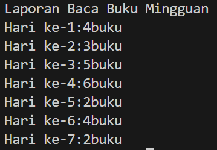
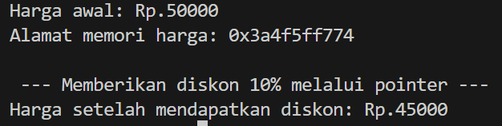
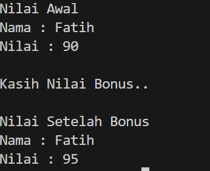
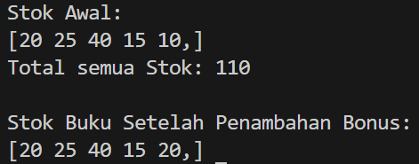

## 1. Nama, NIM, Kelas
- **Nama**: Arzaqi Fatih Muttaqin
- **NIM**: 103112430092
- **Kelas**: Struktur Data-05

## 2. Motivasi Belajar Struktur Data
Belajar struktur data itu seperti mengatur barang di gudang modern, jika semua barang ditumpuk tanpa aturan, proses pencarian akan rumit, memakan waktu, dan menghabiskan ruang. Namun, ketika barang-barang tersebut ditata dengan sistem yang jelas menggunakan rak, label, dan urutan yang teratur, segala aktivitas menjadi jauh lebih mudah, cepat, dan efisien. Struktur data bekerja dengan prinsip yang sama, bukan sekadar menyimpan data, tetapi menyimpannya dengan cara yang tepat agar pengaksesan, pencarian, dan pengelolaan informasi dapat dilakukan secara optimal.

## 3. Dasar Teori

Struktur data adalah cara yang digunakan untuk menyimpan dan menata data di dalam komputer sehingga informasi dapat diproses, dicari, dan dimodifikasi dengan lebih efektif. Dalam bahasa C++, terdapat beberapa konsep dasar yang sering digunakan, di antaranya **array**, **pointer**, dan **fungsi**, yang masing-masing memiliki peran penting dalam pengelolaan data.

Array merupakan kumpulan elemen dengan tipe data yang sama yang disimpan dalam satu wadah dan dapat diakses melalui indeks. Data dalam array tersusun secara berurutan di memori, sehingga memudahkan programmer untuk melakukan operasi seperti penyimpanan, pengurutan, atau pencarian data, misalnya mengelola daftar nilai mahasiswa atau jumlah barang di gudang. **Kusuma dan Rahmadani (2023)** menekankan bahwa array berkontribusi besar dalam pengorganisasian data karena mampu menyimpan banyak informasi secara sistematis.

Sementara itu, pointer adalah variabel yang menyimpan alamat memori dari variabel lain. Dengan memanfaatkan pointer, sebuah program dapat bekerja langsung dengan lokasi memori tertentu, sehingga proses manipulasi data menjadi lebih cepat dan efisien. Teknik ini sangat berguna dalam skenario yang membutuhkan perubahan nilai asli suatu variabel, seperti perhitungan diskon atau pembaruan jumlah stok. Menurut **Santoso dan Wirawan (2022)**, penguasaan pointer menjadi fondasi penting dalam memahami cara kerja memori dalam bahasa C dan C++.

Selain itu, fungsi berperan untuk memecah program menjadi bagian-bagian kecil agar lebih mudah dipahami dan dikembangkan. Salah satu konsep penting dalam fungsi adalah penggunaan parameter referensi, yakni mekanisme pengiriman variabel bukan sebagai salinan, tetapi sebagai alamat sebenarnya. Dengan demikian, setiap perubahan yang dilakukan di dalam fungsi akan berdampak langsung pada variabel asli. **Putri dan Nugroho (2021)** menyatakan bahwa penggunaan parameter referensi dapat meningkatkan efisiensi eksekusi program sekaligus memperkuat penerapan konsep modularitas dalam pengembangan perangkat lunak.
## 4. Guided
### 4.1 Guided 1
```cpp
#include <iostream>

using namespace std;

  

int main() {

    int bukuPerHari[7] = {4,3,5,6,2,4,2};

    int totalBuku = 0;

  

    cout<<"Laporan Baca Buku Mingguan"<<endl;

  

    for (int i = 0; i < 7; i++) {

        cout<<"Hari ke-"<<i+1<<":"<<bukuPerHari[i]

        <<"buku"<<endl;

        totalBuku += bukuPerHari[i];

    }

}
```
Penjelasan :Program tersebut digunakan untuk menampilkan jumlah buku yang berhasil dibaca dalam rentang satu minggu. Informasi mengenai banyaknya buku setiap hari disimpan pada array **bukuPerHari**, kemudian data tersebut ditampilkan secara berurutan mulai dari hari pertama hingga hari ketujuh. Di samping itu, program sebenarnya sudah melakukan proses penjumlahan untuk mengetahui total buku yang dibaca selama seminggu, tetapi hasil akhir tersebut tidak terlihat pada layar karena belum ada perintah **cout** yang digunakan untuk menampilkan nilai total tersebut ke output.

Output :



### 4.2 Guided 2
```cpp
#include <iostream>

  

using namespace std;

  

int main(){

    float hargaProduk = 50000.0f;

  

    float* ptrHarga;

    ptrHarga = &hargaProduk;

  

    cout << "Harga awal: Rp." << hargaProduk << endl;

    cout << "Alamat memori harga: "<< ptrHarga<< endl;

    cout << "\n --- Memberikan diskon 10% melalui pointer ---" << endl;

  

    *ptrHarga = *ptrHarga * 0.9;

  

    cout << "Harga setelah mendapatkan diskon: Rp." << hargaProduk << endl;

return 0;

  

}
```


Penjelasan : Program tersebut digunakan untuk menampilkan harga sebuah produk sekaligus menerapkan potongan harga sebesar 10% dengan memanfaatkan pointer. Pada bagian awal, variabel **hargaProduk** diberi nilai 50.000. Sebuah pointer bernama **ptrHarga** kemudian dibuat untuk menyimpan alamat memori dari variabel tersebut menggunakan operator **&**. Program menampilkan harga awal beserta informasi alamat memorinya. Setelah itu, nilai **hargaProduk** diubah melalui pointer menggunakan perintah `*ptrHarga = *ptrHarga * 0.9`, yang berarti harga dikalikan 0,9 sebagai bentuk diskon 10%. Karena pointer bekerja langsung pada alamat memori variabel aslinya, perubahan yang dilakukan melalui pointer otomatis memengaruhi nilai **hargaProduk**. Di akhir program, harga setelah diskon ditampilkan ke layar sebagai hasil akhir.

Output : 


### 4.3 Guided 3

```cpp
#include<iostream>

using namespace std;

  

float hitungRataRata(int nilaiTugas, int nilaiUts){

    return (nilaiTugas + nilaiUts) / 2.0f;

}

  

void cetakProfil(string nama, float nilai){

    cout<<"Nama : "<<nama<<endl;

    cout<<"Nilai : "<<nilai<<endl;

}

  

void beriNilaiBonus(float&nilai){

    nilai += 5.0f;

}

  

int main(){

    string namaSiswa = "Fatih";

    int tugas = 100, uts = 80;

  

    float nilaiAkhir = hitungRataRata(tugas, uts);

  

    cout <<"Nilai Awal"<<endl;

    cetakProfil(namaSiswa, nilaiAkhir);

  

    cout <<"\nKasih Nilai Bonus.."<<endl;

    beriNilaiBonus(nilaiAkhir);

  

    cout <<"\nNilai Setelah Bonus"<<endl;

    cetakProfil(namaSiswa, nilaiAkhir);

return 0;

}
```


Penjelasan : Program tersebut digunakan untuk memproses dan menampilkan nilai seorang siswa sebelum dan setelah menerima tambahan nilai (bonus). Fungsi **hitungRataRata()** bertugas menghitung rata-rata nilai dengan menggabungkan nilai tugas dan UTS menggunakan formula `(nilaiTugas + nilaiUts) / 2.0f`. Untuk menampilkan identitas serta nilai siswa, program memanfaatkan fungsi **cetakProfil()**. Selain itu, terdapat fungsi **beriNilaiBonus()** yang menambahkan nilai sebesar 5 melalui parameter referensi (**float& nilai**), sehingga perubahan langsung diterapkan pada variabel yang dikirim ke fungsi, bukan pada salinannya. Pada bagian **main()**, nama siswa diatur menjadi **"Fatih"**, dengan nilai tugas 100 dan nilai UTS 80. Setelah rata-rata dihitung dan profil awal ditampilkan, program memberikan tambahan nilai sebesar 5 poin, kemudian menampilkan kembali profil siswa untuk menunjukkan perubahan setelah bonus diberikan.
Output : 



## 5. Unguided
### 5.1 Unguided 1
```cpp
#include <iostream>

using namespace std;

  

void cetakStok(int arr[], int size) {

    cout <<"[";

    for (int i = 0; i < size; i++) {

        cout << arr[i] << (i < size - 1 ? " " : ",");

}

    cout << "]" << endl;

}

  

int hitungTotalStok(int arr[], int size) {

    int total = 0;

    for (int i = 0; i < size; i++) {

        total += arr[i];

    }

    return total;

}

  

int* cariStokPalingSedikit(int arr[], int size) {

    int* ptrPalingSedikit = &arr[0];

    for (int i = 1; i < size; i++) {

        if (arr[i] < *ptrPalingSedikit) {

            ptrPalingSedikit = &arr[i];

        }

    }

    return ptrPalingSedikit;

}

  

void tambahStokBonus(int* ptrStok){

    *ptrStok += 10;

}

int main() {

    int stokBuku[] = {20,25,40,15,10};

    int jumlahJenisBuku = 5;

    cout <<"Stok Awal: " <<endl;

    cetakStok(stokBuku, jumlahJenisBuku);

  

    int total = hitungTotalStok(stokBuku, jumlahJenisBuku);

    cout <<"Total semua Stok: " << total << endl;

  

    int* ptrStokRendah = cariStokPalingSedikit(stokBuku, jumlahJenisBuku);

    tambahStokBonus(ptrStokRendah);

  

    cout << "\nStok Buku Setelah Penambahan Bonus:" << endl;

    cetakStok(stokBuku, jumlahJenisBuku);

  

    return 0;

}
```

Penjelasan ::Program tersebut dirancang untuk mengelola serta menampilkan informasi stok buku dengan memanfaatkan kombinasi **array** dan **pointer**. Fungsi **cetakStok()** berperan dalam menampilkan seluruh isi array stok buku sehingga pengguna dapat melihat data secara terstruktur. Kemudian, fungsi **hitungTotalStok()** digunakan untuk menjumlahkan seluruh nilai pada elemen array guna memperoleh total stok buku yang tersedia. Fungsi **cariStokPalingSedikit()** bertugas mencari elemen dengan jumlah stok paling rendah dan mengembalikan alamat memorinya melalui pointer, sehingga elemen tersebut dapat dimodifikasi secara langsung. Selanjutnya, fungsi **tambahStokBonus()** memanfaatkan pointer yang dikembalikan dari fungsi sebelumnya untuk menambah stok sebesar 10 pada buku yang memiliki stok terendah. Di dalam fungsi **main()**, data stok awal dimasukkan ke dalam array **stokBuku**, kemudian program menampilkan stok awal, menghitung total stok, menentukan buku dengan stok paling sedikit, memberikan tambahan stok, dan akhirnya menampilkan kembali data yang telah diperbarui.

Output : 


## 6. Kesimpulan
Berdasarkan sejumlah contoh program C++ yang telah dipelajari, dapat disimpulkan bahwa pemahaman terhadap konsep fundamental seperti array, pointer, fungsi, parameter referensi, dan operasi aritmetika merupakan pondasi utama dalam pengembangan keterampilan pemrograman yang lebih kompleks. Array memudahkan penyimpanan dan pengelompokan data dalam jumlah banyak, sedangkan **pointer** memberikan kemampuan untuk bekerja langsung dengan alamat memori, sehingga proses manipulasi data menjadi lebih fleksibel dan efisien. Penerapan parameter referensi pada fungsi mendukung penerapan modularitas karena memungkinkan perubahan nilai variabel secara langsung tanpa perlu menciptakan duplikasi data. Di sisi lain, operasi aritmetika pada tipe data numerik seperti float mendukung proses perhitungan dengan ketelitian yang lebih baik. Ketika seluruh konsep tersebut dipahami dan diterapkan secara terpadu, seorang programmer dapat menyusun program yang lebih optimal, terstruktur rapi, serta mampu menyelesaikan permasalahan pemrograman dengan pendekatan yang efektif.

## 7. Referensi
1.  1. Kusuma, A. P., & Rahmadani, D. (2023). _Implementasi Struktur Data Array dalam Efisiensi Pengolahan Data pada Bahasa Pemrograman C++_. Jurnal Teknologi dan Informatika, 9(2), 115–124.
2. Santoso, R., & Wirawan, T. (2022). _Analisis Pemanfaatan Pointer untuk Efisiensi Memori dalam Bahasa Pemrograman C++_. Jurnal Ilmiah Informatika dan Komputer, 7(1), 45–53.
