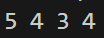
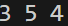
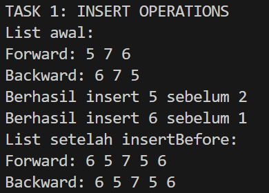
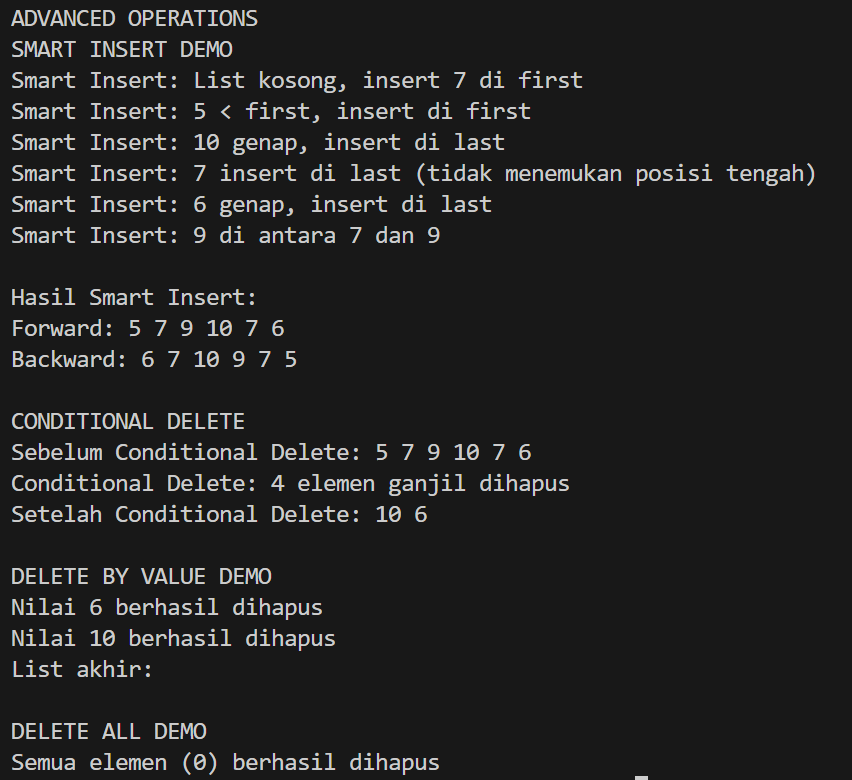

## 1. Nama, NIM, Kelas
- **Nama**: Arzaqi Fatih Muttaqin
- **NIM**: 103112430092
- **Kelas**: Struktur Data-05

## 2. Motivasi Belajar Struktur Data
Struktur Data bukan sekadar materi akademik atau kumpulan konsep teknis, tetapi fondasi utama yang membentuk pola pikir logis dan sistematis dalam dunia pemrograman. Melalui pemahaman struktur data, kita dilatih untuk mengorganisasikan, menyusun, serta memproses data secara optimal, sehingga aplikasi yang kita bangun dapat bekerja dengan lebih cepat, efisien, dan hemat sumber daya. Dengan kata lain, penguasaan struktur data adalah kunci untuk menghasilkan solusi pemrograman yang cerdas dan berkinerja tinggi.

## 3. Dasar Teori

Struktur data merupakan cara untuk menyimpan, mengatur, dan memanipulasi data di dalam komputer sehingga dapat diakses dengan cepat dan digunakan secara efisien. Salah satu struktur data yang cukup populer adalah **Linked List**, yaitu sekumpulan node (simpul) yang tersambung melalui pointer dan tidak harus berada pada lokasi memori yang berurutan. Setiap node dalam linked list memiliki dua komponen utama: **info**, yang menyimpan data seperti angka atau teks, dan **next**, yaitu pointer yang menunjukkan node berikutnya. Node terakhir akan mempunyai pointer **NULL**, yang menandakan bahwa tidak ada node lain setelahnya.

Salah satu variasi yang lebih canggih dari linked list adalah **Double Linked List (DLL)**. Jika pada Single Linked List setiap node hanya memiliki pointer menuju node berikutnya, maka pada DLL setiap node memiliki dua pointer sekaligus: **next** untuk menuju node setelahnya dan **prev** untuk kembali ke node sebelumnya. Untuk memudahkan pengelolaan node-node tersebut, digunakan sebuah **header list** yang menyimpan dua pointer penting, yaitu **first** sebagai penunjuk node pertama dan **last** sebagai penunjuk node terakhir. Header ini tidak menyimpan data, tetapi berfungsi sebagai pintu masuk utama untuk operasi terhadap list.

Linked list memiliki sifat **dinamis**, sehingga ukurannya dapat berubah sesuai kebutuhan program tanpa harus menentukan kapasitas sejak awal. Pertambahan node terjadi melalui proses **alokasi memori** menggunakan operator `new`, yang membentuk node baru serta mengisi bagian info dengan data yang diberikan. Sebaliknya, penghapusan node dilakukan dengan **dealokasi memori** menggunakan operator `delete`, sehingga memori yang sudah tidak terpakai dapat dikembalikan ke sistem dan tidak menyebabkan **memory leak**.

Pada Double Linked List, terdapat beberapa operasi dasar untuk memanipulasi struktur list. Pada proses **penyisipan**, misalnya, kita dapat menggunakan **insertFirst(L, P)** untuk menambahkan node di bagian awal dan memperbarui pointer `L.first`, atau **insertLast(L, P)** untuk menambah node di bagian akhir list dengan menyesuaikan pointer `L.last`. Selain itu, terdapat **insertAfter(L, P, R)** dan **insertBefore(L, P, R)** yang memungkinkan penyisipan di tengah list dengan cara memperbarui pointer `prev` dan `next` dari node-node terkait agar rantai hubungan tetap konsisten.

Operasi lain yang tidak kalah penting adalah **penghapusan node**. Misalnya, **deleteFirst(L, P)** menghapus node paling depan, sedangkan **deleteLast(L, P)** menghapus node paling belakang. Untuk menghapus node yang berada setelah node tertentu, dapat digunakan **deleteAfter(L, P, R)**. Semua operasi ini harus dilakukan dengan hati-hati agar pointer `next` dan `prev` tetap terhubung dengan benar dan list tidak menjadi terputus.

Selain operasi dasar, terdapat pula operasi lanjutan seperti **findElm(L, x)** untuk mencari node yang memiliki nilai info tertentu, serta **deleteByValue(L, x)** untuk menghapus node berdasarkan nilai yang dicari. Apabila ingin mengosongkan seluruh list, dapat digunakan **deleteAll(L)**, yang secara berulang menghapus node dari bagian depan hingga tidak ada node yang tersisa.

Pada implementasi yang lebih kompleks, linked list sering dipadukan dengan logika kondisi melalui operasi seperti **smartInsert** atau **conditionalDelete**, sehingga penyisipan atau penghapusan node dilakukan hanya jika memenuhi syarat tertentu, misalnya berdasarkan nilai data atau posisi node. Saat melakukan penghapusan menggunakan loop, pointer ke node berikutnya perlu disimpan terlebih dahulu (`nextNode = P->next`) sebelum node didealokasi, agar proses iterasi dapat tetap berjalan tanpa gangguan. Dengan memahami seluruh konsep ini, kita dapat memanfaatkan linked list secara optimal untuk membangun program yang fleksibel, efisien, dan mudah dikembangkan.
## 4. Guided
### 4.1 Guided 1
```cpp
#include <iostream>

using namespace std;

#define Nil NULL

  

typedef int infotype;

typedef struct elmlist *address;

  

struct elmlist {

    infotype info;

    address next;

    address prev;

};

  

struct List {

    address first;

    address last;

};

  

address alokasi(infotype x) {

    address P = new elmlist;

    P->info = x ; P->next = Nil; P->prev = Nil; return P;

}

void dealokasi(address &P) {delete P; P = Nil;}

void insertFirst(List &L, address P) {

    P->next = L.first; P->prev = Nil;

    if (L.first != Nil) L.first->prev = P; else L.last = P;

    L.first = P;

}

  

void printInfo(List L) {

    address P = L.first; while (P != Nil) {cout << P->info << " "; P = P-> next;} cout;

}

void deleteFirst(List &L, address &P) {

    P = L.first; L.first = L.first->next;

    if (L.first != Nil) L.first->prev = Nil; else L.last = Nil;

    P->next = Nil; P->prev = Nil;

}

  

void deleteLast (List &L, address &P) {

    P = L.last; L.last = L.last->prev;

    if (L.last != Nil) L.last->next = Nil; else L.first = Nil;

    P->prev = Nil; P->next = Nil;

}

  

void deleteAfter (List &L, address &P, address R) {

    P = R->next; R->next = P->next;

    if (P->next != Nil) P->next->prev = R; else L.last = R;

    P->prev = Nil; P->next = Nil;

}

  

int main() {

    List L; L.first = Nil; L.last = Nil;

    insertFirst(L, alokasi (3)); insertFirst(L, alokasi(4)); insertFirst (L, alokasi(5));

    printInfo(L);

    address P; deleteFirst(L, P); dealokasi (P);

    deleteAfter (L, P, L.first); dealokasi (P);

    printInfo(L);

    return 0;

}
```
Penjelasan :Struktur **elmlist** berfungsi sebagai penampung data sekaligus menyimpan dua pointer penting, yaitu **next** dan **prev**, yang menghubungkan node satu dengan lainnya. Sementara itu, struktur **List** bertindak sebagai kendali utama list, karena menyimpan pointer **first** dan **last** yang menunjukkan node awal dan node akhir. Untuk membuat node baru di memori digunakan fungsi **alokasi()**, sedangkan **dealokasi()** berperan membebaskan memori dari node yang sudah tidak dipakai.
Proses penambahan elemen di bagian depan dilakukan melalui fungsi **insertFirst()**, dan seluruh isi list dapat dilihat menggunakan **printInfo()**. Selain operasi penyisipan, terdapat juga fungsi **deleteFirst()**, **deleteLast()**, dan **deleteAfter()** yang menghapus elemen berdasarkan letaknya dalam list.
Pada bagian **main()**, program menambahkan node bernilai **3, 4, dan 5** secara berturut-turut di bagian depan, sehingga list terbentuk dengan urutan **5 → 4 → 3**. Setelah beberapa operasi penghapusan dijalankan, sisa elemen di dalam list kembali ditampilkan untuk menunjukkan perubahan yang terjadi. Secara keseluruhan, program ini memberikan ilustrasi yang jelas mengenai mekanisme dasar **double linked list**, mulai dari penambahan node, penghapusan elemen, hingga proses traversal list dari kedua arah.
Output : 


### 4.2 Guided 2
```cpp
#include <iostream>

#define Nil NULL

using namespace std;

  

typedef int infotype;

typedef struct elmlist *address;

  

struct elmlist{

    infotype info;

    address next;

    address prev;

};

  

struct List {

    address first;

    address last;

};

  

void insertFirst(List &L, address P) {

    P->next = L.first;

    P->prev = Nil;

    if (L.first != Nil) L.first->prev = P;

    else L.last = P ;

    L.first = P;

}

  

void insertLast(List &L, address P) {

    P->prev = L.last;

    P->next = Nil;

    if (L.last != Nil) L.last -> next = P;

    else L.first = P;

    L.last = P;

}

  

void insertAfter (List &L, address P, address R) {

    P->next = R->next;

    P->prev = R;

    if (R->next != Nil) R->next->prev = P;

    else L.last = P;

    R->next = P;

}

  
  

address alokasi(infotype x) {

    address P = new elmlist;

    P->info = x;

    P->next = Nil;

    P->prev = Nil;

    return P;

}

  

void printInfo(List L) {

    address P = L.first;

    while (P != Nil) {

        cout << P->info << " ";

        P = P-> next ;

    }

    cout << endl;

}

  

int main(){

    List L;

    L.first = Nil;

    L.last = Nil;

    address P1 = alokasi(3);

    insertFirst(L, P1);

    address P2 = alokasi(4);

    insertLast(L, P2);

    address P3 = alokasi(5);

    insertAfter(L, P3, P1);

    printInfo(L);

    return 0;

}
```


Penjelasan : Struktur elmlist berfungsi sebagai simpul yang menyimpan data bersama dua pointer, yaitu next yang mengarah ke node berikutnya dan prev yang menunjuk ke node sebelumnya. Adapun struktur List bertindak sebagai pengendali utama karena menyimpan penunjuk ke elemen pertama (first) dan elemen terakhir (last) dalam list. Untuk membuat sebuah node baru sebelum dimasukkan ke dalam list, digunakan fungsi alokasi().

Beberapa operasi dasar dapat dilakukan pada list. Operasi insertFirst() menambahkan node pada bagian depan list, insertLast() menempatkan node pada posisi paling akhir, sedangkan insertAfter() menyisipkan node setelah elemen tertentu yang sudah ada dalam list.

Pada fungsi main(), program dimulai dari kondisi list yang kosong. Selanjutnya, tiga node dengan nilai 3, 4, dan 5 dimasukkan ke dalam list menggunakan berbagai operasi penyisipan tersebut. Setelah proses penyisipan selesai, susunan elemen di dalam list menjadi 3 → 5 → 4. Susunan ini kemudian ditampilkan menggunakan printInfo(). Secara keseluruhan, program ini memperlihatkan bagaimana operasi penyisipan bekerja pada struktur double linked list, sekaligus menunjukkan cara node saling terhubung melalui pointer next dan prev.

Output : 


### 4.3 Guided 3

```cpp
#include <iostream>

  

#define Nil NULL

  

using namespace std;

  

typedef int infotype;

typedef struct elmlist *address;

  

struct elmlist {

    infotype info;

    address next;

    address prev;

};

  

struct List {

    address first;

    address last;

};

  

void insertFirst(List &L, address P) {

    P->next = L.first;

    P->prev = Nil;

    if (L.first != Nil) L.first->prev = P;

    else L.last = P;

    L.first = P;

}

  

void insertLast(List &L, address P) {

    P->prev = L.last;

    P->next = Nil;

    if (L.last != Nil) L.last->next = P;

    else L.first = P;

    L.last = P;

}

  

void insertAfter(List &L, address P, address R) {

    P->next = R->next;

    P->prev = R;

    if (R->next != Nil) R->next->prev = P;

    else L.last = P;

    R->next = P;

}

  

address alokasi(infotype x) {

    address P = new elmlist;

    P->info = x;

    P->next = Nil;

    P->prev = Nil;

    return P;

}

  

void printInfo(List L) {

    address P = L.first;

    while (P != Nil) {

        cout << P->info << " ";

        P = P->next;

    }

    cout << endl;

}

  

void insertBefore(List &L, address P, address R) {

    P->next = R;

    P->prev = R->prev;

    if (R->prev != Nil)

        R->prev->next = P;

    else

        L.first = P;

    R->prev = P;

}

  

void printReverse(List L) {

    address P = L.last;

    while (P != Nil) {

        cout << P->info << " ";

        P = P->prev;

    }

    cout << endl;

}

  

int main() {

    List L;

    L.first = Nil;

    L.last = Nil;

  

    cout << "TASK 1: INSERT OPERATIONS" << endl;

  

    // Membuat list awal: 5, 6, 7

    address P1 = alokasi(5);

    insertFirst(L, P1);

    address P2 = alokasi(6);

    insertLast(L, P2);

    address P3 = alokasi(7);

    insertAfter(L, P3, P1);

  

    cout << "List awal:" << endl;

    cout << "Forward: ";

    printInfo(L);

    cout << "Backward: ";

    printReverse(L);

  

    // InsertBefore: 5 sebelum 2

    address P4 = alokasi(5);

    insertBefore(L, P4, P2);

    cout << "Berhasil insert 5 sebelum 2" << endl;

  

    // InsertBefore: 6 sebelum 1

    address P5 = alokasi(6);

    insertBefore(L, P5, P1);

    cout << "Berhasil insert 6 sebelum 1" << endl;

  

    cout << "List setelah insertBefore:" << endl;

    cout << "Forward: ";

    printInfo(L);

    cout << "Backward: ";

    printReverse(L);

  

    return 0;

}
```


Penjelasan : Program tersebut menggambarkan bagaimana struktur data double linked list diimplementasikan, di mana setiap node (elmlist) menyimpan sebuah nilai serta dua pointer yang menghubungkannya dengan node sebelumnya dan node sesudahnya. Struktur List berperan sebagai pengendali utama karena menyimpan referensi ke node pertama (first) dan node terakhir (last) dalam rangkaian data.

Beberapa operasi dasar yang digunakan antara lain insertFirst yang menambahkan node di bagian awal list, insertLast yang menambahkan node di bagian akhir, insertAfter yang menyisipkan node setelah elemen tertentu, serta insertBefore yang menempatkan sebuah node sebelum node yang dituju.

Pada fungsi main(), list awal dibentuk dengan urutan nilai 5, 6, dan 7. Setelah list terbentuk, dilakukan penyisipan tambahan, yaitu menempatkan sebuah elemen sebelum 5 dan satu elemen lainnya sebelum elemen tertentu yang belum ada sebelumnya, sehingga susunan node berubah sesuai proses penyisipan tersebut. Hasil akhir list menampilkan urutan baru yang berbeda dari awal, mencerminkan perubahan yang terjadi akibat penambahan elemen-elemen tersebut.

Setelah seluruh operasi selesai, program menampilkan isi list dari arah depan dan belakang. Hal ini dilakukan untuk memastikan bahwa setiap node telah terhubung dengan benar melalui pointer next dan prev, sekaligus menunjukkan fleksibilitas dan kemampuan double linked list dalam memodifikasi data tanpa harus menggeser seluruh elemen seperti pada array.
Output : 



## 5. Unguided
### 5.1 Unguided 1
```cpp
#include <iostream>

  

using namespace std;

  

#define Nil NULL

  

  

typedef int infotype;

  

typedef struct elmlist *address;

  

  

struct elmlist {

  

    infotype info;

  

    address next;

  

    address prev;

  

};

  

  

struct List {

  

    address first;

  

    address last;

  

};

  

  

address alokasi(infotype x) {

  

    address P = new elmlist;

  

    P->info = x;

  

    P->next = Nil;

  

    P->prev = Nil;

  

    return P;

  

}

  

  

void dealokasi(address &P) {

  

    delete P;

  

    P = Nil;

  

}

  

  

void insertFirst(List &L, address P) {

  

    P->next = L.first;

  

    P->prev = Nil;

  

    if (L.first != Nil)

  

        L.first->prev = P;

  

    else

  

        L.last = P;

  

    L.first = P;

  

}

  

  

void printInfo(List L) {

  

    address P = L.first;

  

    while (P != Nil) {

  

        cout << P->info << " ";

  

        P = P->next;

  

    }

  

    cout << endl;

  

}

  

  

void deleteFirst(List &L, address &P) {

  

    P = L.first; L.first = L.first->next;

  

    if (L.first != Nil) L.first->prev = Nil; else L.last = Nil;

  

    P->next = Nil; P->prev = Nil;

  

}

  

  

void deleteLast (List &L, address &P) {

  

    P = L.last; L.last = L.last->prev;

  

    if (L.last != Nil) L.last->next = Nil; else L.first = Nil;

  

    P->prev = Nil; P->next = Nil;

  

}

  

  

void deleteAfter (List &L, address &P, address R) {

  

    P = R->next; R->next = P->next;

  

    if (P->next != Nil) P->next->prev = R; else L.last = R;

  

    P->prev = Nil; P->next = Nil;

  

}

  

  

bool deleteByValue(List &L, infotype x) {

  

    address P = L.first;

  

  

    while (P != Nil && P->info != x) {

  

        P = P->next;

  

    }

  

  

    if (P == Nil) {

  

        cout << "Nilai " << x << " tidak ditemukan" << endl;

  

        return false;

  

    }

  

  

    if (P == L.first) {

  

        L.first = P->next;

  

        if (L.first != Nil)

  

            L.first->prev = Nil;

  

        else

  

            L.last = Nil;

  

    } else if (P == L.last) {

  

        L.last = P->prev;

  

        if (L.last != Nil)

  

            L.last->next = Nil;

  

        else

  

            L.first = Nil;

  

    } else {

  

        P->prev->next = P->next;

  

        P->next->prev = P->prev;

  

    }

  

  

    cout << "Nilai " << x << " berhasil dihapus" << endl;

  

    dealokasi(P);

  

    return true;

  

}

  

  

void deleteAll(List &L) {

  

    address P = L.first;

  

    int count = 0;

  

    while (P != Nil) {

  

        address temp = P;

  

        P = P->next;

  

        dealokasi(temp);

  

        count++;

  

    }

  

    L.first = Nil;

  

    L.last = Nil;

  

    cout << "Semua elemen (" << count << ") berhasil dihapus" << endl;

  

}

  

  

int main() {

  

    List L;

  

    L.first = Nil;

  

    L.last = Nil;

  

  

    cout << "TASK 1: DELETE OPERATIONS" << endl;

  

  

    // List awal: 1 2 3 4

  

    insertFirst(L, alokasi(1));

  

    insertFirst(L, alokasi(2));

  

    insertFirst(L, alokasi(3));

  

    insertFirst(L, alokasi(4));

  

  

    cout << "List awal: ";

  

    printInfo(L);

  

  

    // Delete by value 2

  

    deleteByValue(L, 2);

  

    cout << "Setelah deleteByValue(2): ";

  

    printInfo(L);

  

  

    // Delete value yang tidak ada

  

    deleteByValue(L, 6);

  

    cout << "List tetap: ";

  

    printInfo(L);

  

  

    // Tambah data baru

  

    insertFirst(L, alokasi(6));

  

    cout << "List setelah tambah data: ";

  

    printInfo(L);

  

  

    // Delete semua elemen

  

    deleteAll(L);

  

  

    return 0;

  

}
```

Penjelasan ::Program tersebut menggunakan berbagai fungsi untuk mengelola data dalam struktur linked list. Fungsi alokasi() bertugas menciptakan node baru di memori, sedangkan dealokasi() digunakan untuk membebaskan node yang sudah tidak digunakan agar memori tidak terbuang sia-sia. Operasi insertFirst() memungkinkan penambahan elemen pada bagian awal list, sementara printInfo() berfungsi menampilkan seluruh data yang sedang tersimpan dalam list.

Untuk proses penghapusan, tersedia sejumlah fungsi, antara lain deleteFirst() untuk menghapus elemen pertama, deleteLast() untuk elemen terakhir, deleteAfter() untuk menghapus node yang berada setelah node tertentu, deleteByValue() untuk menghapus berdasarkan nilai yang dicari, serta deleteAll() yang menghapus seluruh isi list tanpa tersisa.

Dalam fungsi main(), program dimulai dengan pembentukan list yang berisi elemen 1, 2, 3, dan 4. Selanjutnya, nilai 1 dihapus dari list, lalu program mencoba menghapus nilai 4 yang sudah tidak ada, kemudian menambahkan beberapa data baru. Di akhir eksekusi, seluruh elemen yang tersisa dihapus satu per satu hingga list kembali berada dalam kondisi kosong. Melalui rangkaian operasi tersebut, program menunjukkan bagaimana linked list dapat dikelola secara dinamis mulai dari penambahan, penghapusan, hingga pengosongan total list.

Output : 


## **Unguided 2**

```cpp
#include <iostream>

using namespace std;

#define Nil NULL

  

typedef int infotype;

typedef struct elmlist *address;

  

struct elmlist {

    infotype info;

    address next;

    address prev;

};

  

struct List {

    address first;

    address last;

};

  

address alokasi(infotype x) {

    address P = new elmlist;

    P->info = x;

    P->next = Nil;

    P->prev = Nil;

    return P;

}

  

void dealokasi(address &P) {

    delete P;

    P = Nil;

}

  

void insertFirst(List &L, address P) {

    P->next = L.first;

    P->prev = Nil;

    if (L.first != Nil)

        L.first->prev = P;

    else

        L.last = P;

    L.first = P;

}

  

void insertLast(List &L, address P) {

    P->prev = L.last;

    P->next = Nil;

    if (L.last != Nil)

        L.last->next = P;

    else

        L.first = P;

    L.last = P;

}

  

void insertAfter(List &L, address P, address R) {

    P->next = R->next;

    P->prev = R;

    if (R->next != Nil)

        R->next->prev = P;

    else

        L.last = P;

    R->next = P;

}

  

void printForward(List L) {

    address P = L.first;

    while (P != Nil) {

        cout << P->info << " ";

        P = P->next;

    }

    cout << endl;

}

  

void printBackward(List L) {

    address P = L.last;

    while (P != Nil) {

        cout << P->info << " ";

        P = P->prev;

    }

    cout << endl;

}

  

// SMART INSERT

void smartInsert(List &L, infotype x) {

    address P = alokasi(x);

    cout << "Smart Insert: ";

  

    // 1) List kosong

    if (L.first == Nil) {

        insertFirst(L, P);

        cout << "List kosong, insert " << x << " di first" << endl;

        return;

    }

  

    // 2) Nilai lebih kecil dari elemen pertama

    if (x < L.first->info) {

        insertFirst(L, P);

        cout << x << " < first, insert di first" << endl;

        return;

    }

  

    // 3) Nilai genap

    if (x % 2 == 0) {

        insertLast(L, P);

        cout << x << " genap, insert di last" << endl;

        return;

    }

  

    // 4) Nilai ganjil (di antara dua nilai)

    address Q = L.first;

    bool inserted = false;

    while (Q->next != Nil) {

        if (Q->info < x && x < Q->next->info) {

            insertAfter(L, P, Q);

            cout << x << " di antara " << Q->info << " dan " << Q->next->info << endl;

            inserted = true;

            break;

        }

        Q = Q->next;

    }

  

    // Jika tidak menemukan posisi di tengah

    if (!inserted) {

        insertLast(L, P);

        cout << x << " insert di last (tidak menemukan posisi tengah)" << endl;

    }

}

  

// CONDITIONAL DELETE (hapus semua bilangan ganjil)

void conditionalDelete(List &L) {

    cout << "Sebelum Conditional Delete: ";

    printForward(L);

  

    address P = L.first;

    int count = 0;

  

    while (P != Nil) {

        address next = P->next;

        if (P->info % 2 != 0) { // hapus ganjil

            if (P == L.first) {

                L.first = P->next;

                if (L.first != Nil) L.first->prev = Nil;

                else L.last = Nil;

            } else if (P == L.last) {

                L.last = P->prev;

                if (L.last != Nil) L.last->next = Nil;

                else L.first = Nil;

            } else {

                P->prev->next = P->next;

                P->next->prev = P->prev;

            }

            dealokasi(P);

            count++;

        }

        P = next;

    }

  

    cout << "Conditional Delete: " << count << " elemen ganjil dihapus" << endl;

    cout << "Setelah Conditional Delete: ";

    printForward(L);

}

  

// MAIN PROGRAM

int main() {

    List L;

    L.first = Nil;

    L.last = Nil;

  

    cout << "ADVANCED OPERATIONS" << endl;

    cout << "SMART INSERT DEMO" << endl;

  

    smartInsert(L, 7);

    smartInsert(L, 5);

    smartInsert(L, 10);

    smartInsert(L, 7);

    smartInsert(L, 6);

    smartInsert(L, 9);

  

    cout << "\nHasil Smart Insert:" << endl;

    cout << "Forward: ";

    printForward(L);

    cout << "Backward: ";

    printBackward(L);

    cout << endl;

  

    cout << "CONDITIONAL DELETE" << endl;

    conditionalDelete(L);

    cout << endl;

  

    cout << "DELETE BY VALUE DEMO" << endl;

    // hapus nilai 6

    int x = 6;

    address P = L.first;

    while (P != Nil && P->info != x) P = P->next;

    if (P != Nil) {

        if (P == L.first) {

            L.first = P->next;

            if (L.first != Nil) L.first->prev = Nil;

        } else if (P == L.last) {

            L.last = P->prev;

            if (L.last != Nil) L.last->next = Nil;

        } else {

            P->prev->next = P->next;

            P->next->prev = P->prev;

        }

        cout << "Nilai " << x << " berhasil dihapus" << endl;

        dealokasi(P);

    } else {

        cout << "Nilai " << x << " tidak ditemukan" << endl;

    }

  

    // hapus nilai 10

    x = 10;

    P = L.first;

    while (P != Nil && P->info != x) P = P->next;

    if (P != Nil) {

        if (P == L.first) {

            L.first = P->next;

            if (L.first != Nil) L.first->prev = Nil;

        } else if (P == L.last) {

            L.last = P->prev;

            if (L.last != Nil) L.last->next = Nil;

        } else {

            P->prev->next = P->next;

            P->next->prev = P->prev;

        }

        cout << "Nilai " << x << " berhasil dihapus" << endl;

        dealokasi(P);

    } else {

        cout << "Nilai " << x << " tidak ditemukan" << endl;

    }

  

    cout << "List akhir: ";

    printForward(L);

    cout << endl;

  

    cout << "DELETE ALL DEMO" << endl;

    int count = 0;

    while (L.first != Nil) {

        address temp = L.first;

        L.first = L.first->next;

        dealokasi(temp);

        count++;

    }

    L.last = Nil;

    cout << "Semua elemen (" << count << ") berhasil dihapus" << endl;

  

    return 0;

}
```
Penjelasan : Program ini menggunakan dua fungsi penting, yaitu Smart Insert dan Conditional Delete. Smart Insert berfungsi menambahkan data ke dalam list, namun proses penambahannya mengikuti ketentuan tertentu sehingga elemen yang dimasukkan tidak hanya ditempatkan secara acak, tetapi sesuai dengan aturan yang ada. Di sisi lain, Conditional Delete bertugas menghapus elemen dari list berdasarkan kondisi yang telah ditentukan, sehingga hanya node yang memenuhi kriteria yang akan dihapus.

Melalui penerapan kedua fungsi tersebut, program menunjukkan bagaimana Double Linked List dapat dikelola secara dinamis. Penambahan dan penghapusan data tidak dilakukan secara asal, melainkan bergantung pada logika yang diterapkan selama program berjalan. Hal ini menjadikan struktur linked list lebih fleksibel dan mampu menyesuaikan diri dengan kebutuhan manipulasi data yang kompleks.

Output : 

## 6. Kesimpulan 
Praktikum ini telah berhasil menerapkan struktur data Doubly Linked List (DLL) dengan cakupan yang cukup lengkap. Implementasi dimulai dari operasi dasar, seperti menambahkan elemen ke awal atau akhir list, menyisipkan data di antara dua node, hingga menghapus elemen dari posisi-posisi tertentu dalam list. Dari dasar tersebut, program kemudian dikembangkan menjadi lebih kompleks dengan penambahan beberapa fitur lanjutan.

Fungsi tambahan seperti findElm digunakan untuk mencari node yang memiliki nilai tertentu, deleteByValue untuk menghapus elemen berdasarkan data yang dicari, serta deleteAll untuk membersihkan seluruh isi list. Selain itu, disertakan pula fungsi smartInsert yang hanya menambahkan elemen sesuai kondisi tertentu, dan conditionalDelete yang menghapus node berdasarkan aturan yang ditentukan, misalnya berdasarkan karakteristik data.

Secara keseluruhan, praktikum ini tidak hanya menekankan pembuatan list semata, tetapi juga pemahaman mendalam terhadap mekanisme pointer next dan prev, proses pengalokasian dan pembebasan memori, serta penanganan kasus-kasus khusus seperti list kosong atau operasi yang melibatkan node paling awal dan paling akhir. Hasil akhir praktikum menunjukkan bahwa mahasiswa mampu menguasai konsep dasar hingga lanjutan dari pengelolaan struktur data berbentuk Doubly Linked List.

## 7. Referensi
1. Cormen, T. H., Leiserson, C. E., Rivest, R. L., & Stein, C. (2022). _Introduction to Algorithms_ (4th ed.). MIT Press.
2. Weiss, M. A. (2014). _Data Structures and Algorithm Analysis in C++_ (4th ed.). Pearson.
3. Wijoyo, A., Prayudi, L. A., Fiqih, M., Santoso, R. D., Putra, R. T., Arifin, T., & Farhan, A. (2024). Penggunaan Algoritma Doubly Linked List Untuk Insertion Dan Deletion. _JRIIN : Jurnal Riset Informatika dan Inovasi_, 1(12), 1329–1331.
4. Sjafari, A. N., & Mulyani, A. (2018). IMPLEMENTASI DOUBLE LINKED LIST PADA APLIKASI ANTRIAN KLINIK. _Jurnal Ilmiah Informatika_, 3(01).