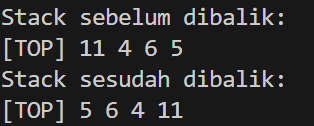
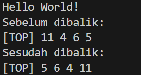
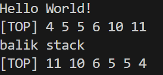
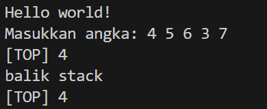

## 1. Nama, NIM, Kelas
- **Nama**: Arzaqi Fatih muttaqin
- **NIM**: 103112430092
- **Kelas**: Struktur Data-05

## 2. Motivasi Belajar Struktur Data
Berlatih struktur data bisa dianalogikan seperti mengatur buku di perpustakaan. Jika semua buku hanya dilempar ke satu ruangan tanpa aturan, kamu akan kesulitan menemukan judul tertentu, ruang cepat penuh, dan proses pencarian memakan waktu lama. Namun, ketika buku-buku disusun berdasarkan kategori, rak, indeks, dan kode katalog, pencarian menjadi jauh lebih cepat, ruang dapat dimanfaatkan secara optimal, dan pengelolaannya menjadi jauh lebih praktis dan efisien.

## 3. Dasar Teori

Struktur data adalah cara untuk menyimpan serta mengatur data dalam komputer sehingga proses pengolahan menjadi lebih efisien. Pada materi ini, pembahasan difokuskan pada konsep Stack atau tumpukan, yaitu salah satu jenis Abstract Data Type (ADT) linear yang bekerja dengan prinsip LIFO, singkatan dari Last In, First Out. Artinya, data yang terakhir dimasukkan ke dalam tumpukan akan menjadi data pertama yang dikeluarkan. Prinsip ini dapat dianalogikan dengan menumpuk gelas; gelas terakhir yang diletakkan di atas adalah gelas pertama yang akan diambil kembali.

Stack yang digunakan dalam materi ini dibuat menggunakan array statis, sehingga kapasitas penyimpanannya sudah ditentukan terlebih dahulu melalui konstanta MaxEl di dalam file stack.h. Semua data ditempatkan secara berurutan dalam array tersebut, dan posisi elemen paling atas ditunjukkan oleh variabel TOP. Jika stack belum berisi elemen, maka TOP bernilai Nil, biasanya -1. Stack dianggap penuh jika TOP sudah berada pada indeks MaxEl dikurangi satu.

Kode yang dipelajari tidak hanya menjelaskan konsep dasarnya, tetapi juga menampilkan beberapa algoritma yang memanfaatkan stack dalam praktik. Contohnya adalah prosedur balikStack, yang berfungsi membalik urutan elemen dengan cara memindahkannya ke stack sementara. Ketika semua elemen dipindahkan, urutannya otomatis menjadi terbalik. Ada pula fungsi pushAscending, yang memasukkan elemen baru sambil menjaga agar susunan data tetap dalam urutan tertentu. Fungsi ini memanfaatkan stack tambahan untuk menyimpan elemen sementara sebelum semuanya dikembalikan ke posisi yang sesuai.

Dengan demikian, materi ini memberikan pemahaman mengenai cara kerja stack secara teoritis sekaligus menunjukkan bagaimana konsep tersebut diterapkan dalam kode program.
## 4. Guided
### 4.1 Guided 1
```cpp
#ifndef STACK_H
#define STACK_H

#define MaxEl 20
#define Nil -1

typedef int infotype;

struct Stack {
    infotype info[MaxEl];
    int TOP;
};

void CreateStack(Stack &A);
bool IsEmpty(Stack A);
bool IsFull(Stack A);
void Push(Stack &A, infotype B);
infotype Pop(Stack &A);
void printInfo(Stack A);

void balikStack(Stack &A);          
void pushAscending(Stack &A, infotype B);
void getInputStream(Stack &A);

#endif
```
Penjelasan : File stack.h berfungsi sebagai bagian awal yang mendefinisikan komponen-komponen penting untuk membangun struktur data Stack sekaligus menyediakan daftar fungsi yang dapat dipanggil oleh file lain, seperti stack.cpp dan main.cpp. Dengan keberadaan file ini, kedua file tersebut memahami bentuk data stack serta operasi apa saja yang bisa dilakukan terhadapnya. Agar file header tersebut tidak diproses lebih dari sekali saat kompilasi, digunakan teknik pengaman berupa header guard melalui kombinasi perintah #ifndef, #define, dan #endif.
Pada file ini terdapat beberapa konstanta yang ditentukan menggunakan #define. Salah satunya adalah MaxEl, bernilai 20, yang menjadi batas ukuran array sehingga stack diimplementasikan dengan alokasi statis. Selain itu terdapat nilai Nil, biasanya -1, yang digunakan untuk menunjukkan kondisi ketika stack tidak memiliki elemen. File ini juga menyertakan typedef int infotype yang berfungsi sebagai alias tipe data untuk elemen stack, sehingga memudahkan perubahan tipe data bila suatu saat diperlukan. Bagian inti dari stack.h adalah deklarasi struktur Stack. Di dalam struktur tersebut terdapat sebuah array info berukuran MaxEl yang berfungsi menyimpan elemen-elemen stack, dan sebuah variabel TOP yang menyimpan indeks elemen teratas. Kedua komponen ini menjadi pondasi utama dalam representasi stack pada program. Selain struktur dan konstanta, stack.h juga memuat deklarasi berbagai fungsi yang akan direalisasikan dalam file kode sumber. Fungsi-fungsi ini meliputi operasi dasar seperti membuat stack, mengecek keadaan kosong atau penuh, menambahkan elemen, mengambil elemen dari bagian atas, hingga menampilkan seluruh isi stack. Tidak hanya itu, terdapat pula fungsi tambahan seperti membalik isi stack, memasukkan elemen dengan menjaga urutan tertentu, dan membaca banyak masukan sekaligus. Deklarasi ini memungkinkan file lain memanfaatkan semua fitur stack tanpa perlu mengetahui bagaimana fungsi-fungsi tersebut bekerja secara internal.


### 4.2 Guided 2
```cpp
#include "stack.h"
#include <iostream>
using namespace std;

void CreateStack(Stack &S) {
    S.TOP = Nil; // Nil = -1
}

bool IsEmpty(Stack S) {
    return S.TOP == Nil;
}

bool IsFull(Stack S) {
    return S.TOP == MaxEl - 1;
}

void Push(Stack &S, infotype X) {
    if (!IsFull(S)) {
        if (IsEmpty(S)) {
            S.TOP = 0;
        } else {
            S.TOP++;
        }
        S.info[S.TOP] = X;
    } else {
        cout << "Stack penuh" << endl;
    }
}

infotype Pop(Stack &S) {
    infotype X = -999;
    if (!IsEmpty(S)) {
        X = S.info[S.TOP];
        S.TOP--;
        if (S.TOP < 0) {
            S.TOP = Nil;
        }
    } else {
        cout << "Stack kosong" << endl;
    }
    return X;
}

void printInfo(Stack S) {
    if (IsEmpty(S)) {
        cout << "Stack kosong" << endl;
    } else {
        cout << "[TOP] ";
        for (int i = S.TOP; i >= 0; i--) {
            cout << S.info[i] << " ";
        }
        cout << endl;
    }
}

void balikStack(Stack &S) {
    if (!IsEmpty(S)) {
        Stack temp;
        CreateStack(temp);
        while (!IsEmpty(S)) {
            Push(temp, Pop(S));
        }
        S = temp;
    }
}

  

void pushAscending(Stack &S, infotype X) {
    if (IsFull(S)) {
        cout << "Stack penuh" << endl;
        return;
    }

    Stack temp;
    CreateStack(temp);
    while (!IsEmpty(S) && S.info[S.TOP] < X) {
        Push(temp, Pop(S));
    }

    Push(S, X);
    while (!IsEmpty(temp)) {
        Push(S, Pop(temp));
    }
}

void getInputStream(Stack &S) {
    cout << "Masukkan angka: ";
    string input;
    cin >> input;

    for (char c : input) {
        if (isdigit(c)) {
            int value = c - '0';
            Push(S, value);
        }
    }
}
```


Penjelasan :File stack.cpp berisi realisasi konkret dari struktur data Stack yang disusun menggunakan array dan menerapkan prinsip LIFO, yaitu elemen yang terakhir dimasukkan akan menjadi elemen pertama yang dikeluarkan. Di awal file, stack.cpp mengimpor stack.h agar mengetahui bentuk struktur Stack beserta konstanta yang telah didefinisikan, serta memanggil pustaka iostream untuk menangani proses masukan dan keluaran. Inisialisasi stack dilakukan melalui prosedur CreateStack dengan menyetel nilai TOP menjadi Nil sebagai tanda bahwa tumpukan masih kosong. Keadaan stack kemudian dapat diperiksa menggunakan fungsi IsEmpty dan IsFull yang membantu menentukan apakah operasi push atau pop dapat dilakukan. Operasi Push berfungsi menempatkan data baru pada posisi teratas selama batas maksimum elemen belum tercapai, sedangkan Pop digunakan untuk menghapus sekaligus mengambil elemen paling atas jika stack memiliki isi. Untuk menampilkan kondisi tumpukan, tersedia prosedur printInfo yang menampilkan setiap elemen dimulai dari yang berada di posisi TOP hingga elemen terbawah. Selain operasi dasar tersebut, file ini juga menambahkan fitur manipulasi lanjutan. Salah satu di antaranya adalah balikStack, yang memanfaatkan stack tambahan agar susunan data menjadi terbalik secara otomatis setelah dipindahkan. Fitur lainnya adalah pushAscending, yang memasukkan elemen baru sambil mempertahankan urutan data dari kecil ke besar dengan memindahkan elemen tertentu ke stack sementara sebelum mengembalikannya ke urutan semula. Terdapat pula fungsi getInputStream yang menerima masukan berupa deretan karakter angka, kemudian mengubahnya menjadi bilangan bulat sebelum menambahkannya ke dalam stack. Keseluruhan fungsi yang ada pada stack.cpp ini saling mendukung untuk membangun perilaku stack yang lengkap, mulai dari pengelolaan data, pengaturan urutan elemen, hingga menampilkan isi tumpukan dengan jelas.

### 4.3 Guided 3

```cpp
#include "stack.h"

#include <iostream>

using namespace std;

  

int main() {

    Stack S;

    CreateStack(S);

  

    // Operasi stack

    Push(S, 5);

    Push(S, 6);

    Push(S, 10);

    Pop(S);

    Push(S, 4);

    Push(S, 5);

    Pop(S);

    Push(S, 11);

  

    cout << "Stack sebelum dibalik:" << endl;

    printInfo(S);

  

    balikStack(S);

  

    cout << "Stack sesudah dibalik:" << endl;

    printInfo(S);

  

    return 0;

}
```


Penjelasan : main.cpp berfungsi sebagai pusat eksekusi program yang memanfaatkan seluruh operasi stack yang telah didefinisikan dalam stack.h dan diimplementasikan pada stack.cpp. File ini meng-include stack.h agar dapat mengakses struktur data Stack beserta fungsi-fungsinya, sekaligus meng-include pustaka input-output untuk menampilkan informasi kepada pengguna. Di dalam fungsi main(), sebuah variabel stack bernama S dibuat dan diinisialisasi terlebih dahulu dengan memanggil CreateStack(S), sehingga tumpukan berada pada kondisi kosong saat program mulai berjalan. Selanjutnya, dilakukan serangkaian operasi untuk menguji cara kerja stack. Pada contoh ini, nilai yang dimasukkan dan dikeluarkan adalah 5, 6, 10, 4, 5, dan 11, dengan urutan operasi sebagai berikut: Push(5), Push(6), Push(10), Pop(), Push(4), Push(5), Pop(), dan Push(11). Urutan ini menghasilkan sebuah susunan elemen tertentu pada bagian akhir. Setelah rangkaian operasi selesai, program menampilkan keadaan stack saat itu dengan mencetak kalimat "Stack sebelum dibalik:" kemudian memanggil printInfo(S) untuk menampilkan isi stack dari elemen teratas hingga terbawah. Berikutnya, fungsi balikStack(S) dipanggil untuk mengubah urutan elemen menjadi kebalikan dari kondisi awal. Untuk memperlihatkan hasil perubahannya, program menampilkan tulisan "Stack sesudah dibalik:" dan kembali menjalankan printInfo(S). Dengan cara ini, perbedaan kondisi stack sebelum dan sesudah proses pembalikan dapat dilihat dengan jelas oleh pengguna.
Output : 



## 5. Unguided
### 5.1 Unguided 1
```cpp
#include "stack.h"

#include <iostream>

using namespace std;

  

int main() {

    cout << "Hello World!" << endl;

    Stack S;

    CreateStack(S);

  

    // Operasi stack

    Push(S, 5);

    Push(S, 6);

    Push(S, 10);

    Pop(S);

    Push(S, 4);

    Push(S, 5);

    Pop(S);

    Push(S, 11);

  

    cout << "Sebelum dibalik:" << endl;

    printInfo(S);

  

    balikStack(S);

  

    cout << "Sesudah dibalik:" << endl;

    printInfo(S);

  

    return 0;

}
```

Penjelasan ::Unguided1.cpp berfungsi sebagai program uji coba yang memastikan seluruh operasi Stack berjalan sesuai dengan implementasi yang ada, mirip dengan peran yang dijalankan oleh main.cpp. File ini tetap meng-include stack.h untuk memperoleh akses terhadap struktur data Stack beserta fungsinya, serta meng-include pustaka input-output agar hasil eksekusi dapat ditampilkan di layar. Perbedaan yang paling terlihat dibandingkan main.cpp adalah adanya pesan pembuka berupa tulisan "Hello World!" yang muncul saat program pertama kali dijalankan. Setelah pesan tersebut tampil, program melanjutkan proses pengujian stack dengan alur kerja yang hampir sama. Sebuah variabel Stack bernama S dibuat dan diinisialisasi menggunakan CreateStack(S) sehingga tumpukan berada dalam kondisi kosong pada awal eksekusi. Selanjutnya, program menjalankan rangkaian operasi stack menggunakan angka yang sama seperti contoh sebelumnya, yaitu Push(5), Push(6), Push(10), Pop(), Push(4), Push(5), Pop(), dan Push(11). Operasi-operasi tersebut menghasilkan susunan elemen tertentu pada akhir proses. Setelah semua instruksi dijalankan, Unguided1.cpp menampilkan kondisi stack sebelum dilakukan pembalikan susunan, kemudian memanggil fungsi balikStack(S) untuk membalik urutan elemen, dan akhirnya menampilkan kembali isi stack setelah proses tersebut selesai. Dengan demikian, perubahan susunan elemen dapat diamati secara langsung, sekaligus menunjukkan bahwa fungsi-fungsi stack telah bekerja dengan benar.

Output : 



### 5.1 Unguided 2
```cpp
#include "stack.h"

#include <iostream>

using namespace std;

  

int main() {

    cout << "Hello World!" << endl;

    Stack S;

    CreateStack(S);

    pushAscending(S, 5);

    pushAscending(S, 6);

    pushAscending(S, 10);

    pushAscending(S, 4);

    pushAscending(S, 5);

    pushAscending(S, 11);

    printInfo(S);

    cout << "balik stack" << endl;

    balikStack(S);

    printInfo(S);

    return 0;

}
```

Penjelasan ::Unguided2.cpp berperan sebagai program utama yang secara khusus digunakan untuk menguji perilaku fungsi pushAscending pada struktur Stack. Seperti file sebelumnya, program ini meng-include stack.h agar dapat memanfaatkan definisi dan operasi stack, serta meng-include pustaka iostream untuk menampilkan keluaran ke layar. Program mendeklarasikan sebuah variabel Stack bernama S dan menginisialisasikannya dengan CreateStack(S), sehingga kondisi awal tumpukan masih kosong. Tidak seperti driver lain yang menguji push standar, unguided ini fokus pada penyisipan elemen dengan mempertahankan urutan menaik. Sebagai skenario pengujian, program memanggil pushAscending secara berurutan menggunakan nilai 5, 6, 10, 4, 5, dan 11. Pemilihan angka tersebut dimaksudkan untuk melihat bagaimana stack menyusun dirinya setiap kali ada elemen yang dimasukkan, terutama ketika nilai baru lebih kecil atau sama dengan nilai yang ada di bagian atas stack. Setelah seluruh elemen dimasukkan, printInfo(S) dipanggil untuk menampilkan hasil akhir susunan data yang telah tertata sesuai aturan ascending. Untuk memberikan pengujian tambahan, stack yang sudah tersusun tersebut kemudian dibalik dengan memanggil balikStack(S). Setelah proses ini selesai, program kembali mencetak isi stack agar perubahan urutan elemen dapat diamati secara jelas. Dengan demikian, Unguided2.cpp tidak hanya menunjukkan cara kerja pushAscending, tetapi juga memperlihatkan konsistensi perilaku stack ketika susunannya dimanipulasi lebih lanjut.

Output : 



### 5.1 Unguided 3
```cpp
#include "stack.h"

#include <iostream>

using namespace std;

  

int main()

{

    cout << "Hello world!" << endl;

    Stack S;

    CreateStack(S);

    getInputStream(S);

    printInfo(S);

    cout << "balik stack" << endl;

    balikStack(S);

    printInfo(S);

    return 0;

}```

Penjelasan :Unguided3.cpp berfungsi sebagai program penguji yang difokuskan pada penggunaan fungsi getInputStream(S). Sama seperti driver lainnya, file ini meng-include stack.h agar struktur dan operasi stack dapat digunakan, serta meng-include iostream untuk menampilkan keluaran ke layar. Di dalam fungsi main, sebuah variabel Stack S dideklarasikan dan diinisialisasi terlebih dahulu dengan CreateStack(S), sehingga tumpukan berada dalam keadaan kosong sebelum data dimasukkan. Perbedaan utama program ini dibandingkan driver sebelumnya terletak pada sumber datanya. Jika pada program lain nilai-nilai yang dimasukkan sudah ditentukan dalam kode, Unguided3.cpp justru memberikan kendali penuh kepada pengguna. Saat fungsi getInputStream(S) dijalankan, program menunggu input berupa rangkaian angka yang akan diproses dan dimasukkan ke stack satu per satu sesuai prosedur yang telah ditentukan pada implementasi stack. Begitu proses pemasukan data selesai, program menampilkan susunan elemen dalam stack menggunakan printInfo(S) untuk menunjukkan hasil input yang telah diterima. Sebagai langkah tambahan untuk memastikan bahwa fungsi manipulasi lainnya berjalan sebagaimana mestinya, program memanggil balikStack(S) untuk membalik urutan elemen yang sudah ada. Setelah itu, printInfo(S) dipanggil kembali untuk memperlihatkan kondisi stack setelah pembalikan. Dengan demikian, pengguna dapat membandingkan susunan elemen sebelum dan sesudah proses tersebut, sekaligus memahami bagaimana fungsi-fungsi stack bekerja secara keseluruhan.
Output : 


## 6. Kesimpulan
Secara keseluruhan, keenam program tersebut bekerja seperti rangkaian komponen yang saling melengkapi untuk menunjukkan bagaimana sebuah Stack statis berbasis array dibangun dan diuji dari awal hingga akhir. Struktur tugasnya tersusun dengan rapi. File stack.h menjadi pusat deklarasi, menentukan bentuk dasar Stack melalui array info berukuran MaxEl dan variabel TOP, sekaligus menyediakan daftar fungsi yang dapat dipanggil oleh bagian lain dalam sistem. Seluruh fungsi tersebut diwujudkan dalam stack.cpp, yang mengatur cara kerja stack mulai dari operasi dasar seperti Push dan Pop, pengecekan kondisi kosong dan penuh, hingga kemampuan lanjutan seperti membalik elemen dengan balikStack, memasukkan nilai secara berurutan menggunakan pushAscending, serta membaca input angka melalui getInputStream. Empat file lainnya tidak mengubah struktur stack, tetapi memastikan bahwa setiap fungsinya berjalan sebagaimana mestinya dengan skenario pengujian yang berbeda. main.cpp dan Unguided1.cpp menguji perilaku umum stack, termasuk proses penyimpanan data, penghapusan elemen, dan pembalikan isi stack untuk memastikan fungsi dasar bekerja dengan benar. Unguided2.cpp secara khusus menyoroti cara kerja pushAscending untuk melihat apakah tumpukan tetap terurut saat elemen baru dimasukkan. Sementara itu, Unguided3.cpp berfokus pada proses memasukkan data dari pengguna lewat getInputStream, sekaligus mengecek apakah data yang telah dikumpulkan dapat dimanipulasi kembali, misalnya dengan membalik urutannya. Dengan pembagian tugas seperti ini, setiap bagian dari sistem memiliki perannya masing-masing. Hasil akhirnya adalah sebuah demonstrasi lengkap yang memperlihatkan bagaimana stack tidak hanya didefinisikan dan diimplementasikan, tetapi juga diuji fungsionalitasnya dari berbagai sudut.

## 7. Referensi
1. 1. Fathurrozi, M., & WN, H. (2024). Application of Stack Data Structure in Application Development. _JASIC (Journal of Applied Science, Informatics, and Computing)_, _2_(1), 1-8.
2. Mak, T., & Mitrović, S. (2024). Execution Efficiency of the use of Array and Linked-List Implementations of a Stack Abstract Data Types... in Methods of an Android Application. _TEM Journal_, _13_(2), 1618–1632.
3. Novikov, E., Glushkov, A., & Ignatev, D. (2021). Technology Stack Selection Model for Software Design of Digital Platforms. _Mathematics_, _9_(4), 308.
4. Setiyawan, D., & Simarmata, E. P. (2024). Penggunaan Struktur Data Stack dalam Pemrograman C++ dengan Pendekatan Array dan Linked List. _JUTECH : Journal Education and Technology_, _3_(2), 116-123.